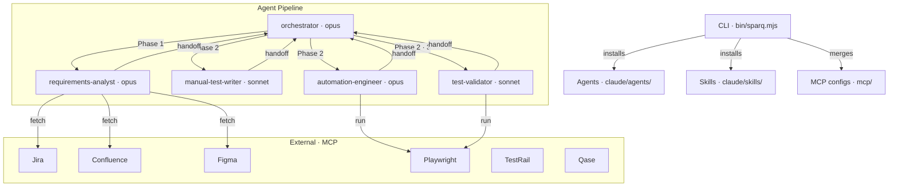

# CLAUDE.md

SparQ is a QA testing framework for Claude Code — CLI installer + agent pipeline + skills + MCP integrations.

## Commands

```bash
npm run check                               # lint + test (run before every commit)
npm test                                    # All tests (unit + integration)
npm run test:unit                           # Unit tests only
npm run test:integration                    # Integration tests only
node --test test/unit/parseArgs.test.mjs    # Single test file
npm run test:coverage                       # Tests with coverage
npm run lint                                # Biome lint check
npm run lint:fix                            # Biome auto-fix
node --check bin/sparq.mjs                  # Syntax-check CLI entry point
```

## Architecture



> **Note:** Browser preview and screenshot verification require Playwright MCP. Cypress projects use `npx tsc --noEmit` and `npx cypress verify` for smoke checks instead.

- **CLI** (`bin/sparq.mjs` → `bin/lib/`): Pure ESM Node.js installer + eval runner — init, update, uninstall, clean, doctor, audit, help, eval, improve, baseline, tune
- **Agents** (`claude/agents/`): 5 markdown agents with YAML frontmatter. Orchestrator classifies S1–S6, dispatches via structured handoffs (claude/skills/sparq-shared/references/handoff-schema.md)
- **Skills** (`claude/skills/`): 24 skill directories — QA workflow skills (`/sparq:start`, `/sparq:generate`, `/sparq:generate-manual`, `/sparq:generate-e2e`, `/sparq:manual-to-e2e`, `/sparq:validate`, `/sparq:sync`, `/sparq:regression`, `/sparq:refactor`, `/sparq:export`), setup (`/sparq:init`, `/sparq:config`, `/sparq:tune`), framework best practices (`/sparq:playwright-best-practices`, `/sparq:cypress-best-practices`), orchestrator internals (`/sparq:analyze`, `/sparq:resume`), and framework dev tools (`/sparq:eval`, `/sparq:improve`, `/sparq:baseline-promote`, `/sparq:eval-reflect`, `/sparq:eval-tune`, `/sparq:optimize`, `/sparq:audit-prompts`)
- **References** (`claude/skills/sparq-shared/references/`): 38 shared docs — codebase-readiness.md, config-schema.md, confluence-patterns.md, cypress-advanced.md, cypress-anti-patterns.md, cypress-architecture.md, cypress-patterns.md, cypress-testing-strategies.md, data-model.md, degradation-strategy.md, e2e-common-patterns.md, error-handling.md, eval-workflow.md, figma-patterns.md, handoff-schema.md, jira-patterns.md, local-tms-formats.md, mcp-tool-inventory.md, parallel-execution.md, pattern-adherence.md, playwright-a11y-visual.md, playwright-anti-patterns.md, playwright-assertions.md, playwright-auth-mocking.md, playwright-ci-reporting.md, playwright-mcp-tools.md, playwright-patterns.md, progress-protocol.md, qase-formats.md, refresh-patterns.md, regression-workflow.md, resume-protocol-agent.md, resume-protocol.md, test-generation-patterns.md, testrail-formats.md, tms-abstraction.md, token-budget.md, validation-checklist.md
- **MCP** (`mcp/`): Atlassian (HTTP), Figma (HTTP), Playwright (stdio), TestRail (stdio), Qase (stdio)
- **Templates** (`claude/templates/`): 11 output templates — requirements.md, test-case.md, coverage-matrix.md, validation-report.md, execution-plan.md, execution-plan.json, checkpoint.md, refresh-diff.md, jira-coverage-comment.md, quickref.md, run-summary.md
- **Rules** (`.claude/rules/`): 5 scoped rule files for path-specific validation (agents, skills, cli, references, tests)
- **Output**: E2E test code → project test directory (`e2e/`); metadata artifacts → `.sparq/`; workflow state → `.sparq/state/`

## Code Standards

### Style (enforced by Biome — `biome.json`)
- Pure ESM with `.mjs` extensions — `import`/`export` only, named exports only
- Zero runtime dependencies — only `node:*` built-in modules (requires Node >= 22)
- Uses `node:util` (`styleText`, `parseArgs`), `node:fs` (`globSync`), `import.meta.dirname`
- Colors: `style` object in `state.mjs` wraps `styleText` — never use raw ANSI codes
- `const` required, `var` forbidden, single quotes, no semicolons, 2-space indent, trailing commas
- Line width: 100 characters

### Quality Gates — MUST pass before any change is complete
- `npm run lint` — zero warnings
- `npm test` — all tests pass
- `node --check` on every `.mjs` file touched
- New CLI modules require unit tests in `test/unit/`
- New features require integration test coverage in `test/integration/`
- IMPORTANT: Never introduce runtime dependencies — only Node.js built-in modules allowed
- IMPORTANT: Never use default exports — all modules use named exports only

### Generated Code Quality (agents producing E2E tests)
- Read existing project patterns BEFORE generating — match exactly (claude/skills/sparq-shared/references/pattern-adherence.md)
- Reuse existing page objects, components, fixtures — never recreate what exists
- Every new file gets a barrel `index.ts` update
- Smoke verify: Playwright: `npx playwright test --list`; Cypress: `npx cypress verify`; or `npx tsc --noEmit` must pass

## Agent Orchestration

Full orchestration logic lives in claude/agents/sparq-orchestrator.md. Key rules below.

### Scenarios
- **S1** Manual Creation: Reqs → manual test cases (MD + TMS export)
- **S1+S2** Generate (Unified): Reqs → manual test cases AND E2E code in one pipeline (`/sparq:generate`)
- **S2** Manual to E2E: Manual tests (file or TMS read) → E2E code (Playwright or Cypress per config)
- **S3** E2E Test Generation: Reqs → E2E code directly
- **S4** Test Validation: Existing tests → validation report + fixes
- **S5** Requirement Sync: Updated reqs + existing tests → diff analysis + test updates
- **S6** Bug Regression: Bug ticket → single focused regression spec (`/sparq:regression`)

### Coordination Rules
- All agent-to-agent communication uses structured handoffs (claude/skills/sparq-shared/references/handoff-schema.md)
- IMPORTANT: Never skip checkpoints — every phase transition requires explicit user approval
- Sub-agents cannot spawn other sub-agents — provide complete context in dispatch
- Parallel execution details: claude/skills/sparq-shared/references/parallel-execution.md
- IMPORTANT: Never share Tier 1 (exclusive) write targets between parallel tasks — shared files use Tier 2 staged merge via `.sparq/parallel/`

### Progress Visibility
- Agents emit `[sparq]`-prefixed progress signals between checkpoints for real-time pipeline visibility
- Signal format and timing rules: claude/skills/sparq-shared/references/progress-protocol.md

### Resume Protocol
- Workflow state persisted to `.sparq/state/` (4 files: current-task.json, config-snapshot.json, parallel.json, journal.jsonl)
- Resume auto-detected by `/sparq:start` — checks `.sparq/state/current-task.json`, offers continue/fresh-start
- State priority: current-task.json > journal.jsonl > execution-plan.md (legacy)
- Full protocol: claude/skills/sparq-shared/references/resume-protocol.md

## Content Generation Standards

### Agent & Skill Prompt Design
- Use XML tags for section boundaries: `<classification_rules>`, `<rules>`, `<done_criteria>`, `<handoff>`, `<references>`, `<few_shot_examples>`
- Use lists instead of tables — ~30–40% token savings
- Use mermaid diagrams instead of ASCII art for any visual flow
- Use gerund-form descriptions in YAML frontmatter for trigger accuracy
- Include `<done_criteria>` with explicit completion checklist — agents verify ALL items before handoff
- Include `<references>` listing all files the agent must load at startup

### Generated Artifact Quality
- Requirements: unique `REQ-{feature}-{NNN}` IDs, source labels (SRC-J/C/F/L), acceptance criteria for every req
- Test cases: unique `TC-{feature}-{ABBR}-{NNN}` IDs, all 5 categories (HP/VE/SEC/EC/A11Y), traceability to REQ IDs
- Playwright code: `get` accessors for locators, extend project base class, import from fixture index — not `@playwright/test`
- Cypress code: `get` accessors for chainables, `describe`/`it` blocks, import from support barrel
- Coverage matrix: every REQ mapped to TC IDs, percentage calculated from acceptance criteria coverage
- Validation findings: severity-classified (Critical/Warning/Info), unique `VF-{n}` IDs, auto-fix proposals where deterministic
- Regression tests: unique `REG-{ticket}-{NNN}` IDs, tagged `@regression`, reuse existing page objects, single spec per bug ticket
- IMPORTANT: All generated output follows templates in `claude/templates/` — never invent new formats

## Enterprise Patterns

### Error Handling (claude/skills/sparq-shared/references/error-handling.md)
- Recoverable (MCP timeout, 429/5xx): auto-retry with exponential backoff, max 3 retries
- Blocking (missing config, no reqs found): pause workflow, notify user
- Critical (invalid project structure): HALT ALL, immediate user alert

### Resilience (claude/skills/sparq-shared/references/degradation-strategy.md)
- Three layers: Retry → Fallback → Circuit Breaker (2 failures in 60s trips OPEN)
- Per-source fallbacks: Jira → user text input, Confluence → skip with gap, Figma → codebase grep for selectors
- Parallel degradation: Task tool unavailable → sequential fallback; partial completion → merge succeeded + retry failed

### Security
- NEVER commit or generate files containing real credentials, API keys, or tokens
- MCP configs in `mcp/` use placeholder values only — real credentials go in target project `.mcp.json`
- Test data uses realistic but fake values (e.g., `test.user@example.com`, `P@ssw0rd123!`)

## Token Budget

Context window: 200K tokens. Fixed overhead (system + CLAUDE.md + MEMORY.md): ~10.5K tokens.

### Key Limits
- Max requirements per workflow: 40 (recommend feature-split above 25)
- Max manual tests per batch: 30; max E2E tests per batch: 20
- Max scenario chain depth: 3 (e.g., S1->S2->S4 for generate+convert+validate)
- Max test files for S4 validation: 40 (parallel across <=6 tasks; 41+ requires feature-scoped splitting)
- Handoff max size: 3,000 tokens (~12KB)
- Orchestrator warning at 120K tokens; hard limit at 150K -- suggest scope reduction or fresh conversation
- Full budget reference: claude/skills/sparq-shared/references/token-budget.md

## Verification

### Before Committing CLI Changes
1. `npm run lint` — zero warnings
2. `npm test` — all tests pass
3. `node --check` on every `.mjs` file modified
4. New module → corresponding unit test exists in `test/unit/`

### Before Committing Agent/Skill/Reference Changes
1. YAML frontmatter has required fields (`name`, `description`, `model` for agents)
2. All `@path` references point to existing files
3. Run relevant eval: `npx sparq-assistant eval {case} --strict` (or `node test/evals/run-eval.mjs {case}`)
4. `<done_criteria>` section exists and every item is verifiable
5. Sub-agents have a handoff section (`<handoff>` tag or `## Handoff` heading) matching claude/skills/sparq-shared/references/handoff-schema.md

### After Prompt Optimization (agents, skills, references)
1. No handoff entries displaced outside canonical sections (per `agents.md` Structural Rules)
2. Inline reference mentions match formal `## References` sections (per `skills.md` References Section)
3. `<done_criteria>` unchanged — optimization must not alter completion checklists
4. YAML frontmatter unchanged — optimization must not alter agent identity fields
5. Agents remain under 300 lines (`wc -l claude/agents/*.md`)
6. `@path` references still point to existing files after any renames or moves
7. No content-bearing examples removed from references (few-shot templates, TypeScript patterns)

### Before Committing MCP Config Changes
1. Valid JSON: `node --input-type=module -e "import{readFileSync}from'node:fs';JSON.parse(readFileSync('mcp/{file}.json','utf-8'))"`
2. Placeholder values only — no real credentials

## Testing

- Framework: `node:test` + `node:assert/strict` (zero test deps)
- Unit tests (`test/unit/`): 45 files testing CLI modules and eval engine
- Integration tests (`test/integration/`): 10 files testing full init→doctor→update→uninstall lifecycle and eval flow
- Helpers: `test/helpers/setup.mjs` — `createTempDir()`, `cleanTempDir()`, `createMockProject()`, `runCli()`
- Eval framework (`test/evals/`): YAML cases, code-based rubrics (`.mjs`), model-based graders (`.md`)
  - Automated rubrics: format-compliance, coverage-completeness, playwright-syntax, cypress-syntax, error-handling-compliance, parallel-merge
  - Model-based graders: test-quality-grader, code-quality-grader, error-handling-grader
  - Run: `npx sparq-assistant eval {case} --strict` (or `node test/evals/run-eval.mjs {case}`)
- Eval self-improvement workflow (lean default + advanced path)
  - Default flow: `sparq eval --strict` -> `sparq improve <case|--all>` -> `sparq baseline promote <case|--all>`
  - Model readiness: if latest strict run used `mock`, run `sparq improve <case|--all> --model haiku` for generation-capable tuning
  - Promotion policy: requires 2 consecutive clean strict passes and clear optimize gate
  - `improve` machine-readable contract: `IMPROVE_STATUS`, `IMPROVE_ITERATIONS`, `IMPROVE_TUNED_FILES`, `NEXT_ACTION`
  - Default help hides advanced primitives; use `sparq help advanced` to view non-default/service commands
  - Advanced/service primitives: `/sparq:eval-reflect`, `/sparq:eval-tune`, `/sparq:optimize` (non-default)
  - CLI analysis: `sparq eval --audit` / `--trends` / `--project <dir>` / `--allow-skips`
  - Data: `test/evals/data/runs/` (auto-saved), `baselines/` (gold standard), `reflections/` (analysis)
  - Pass threshold: 75%

## Adding Content

- **New agent**: Create `claude/agents/sparq-{name}.md` with YAML frontmatter (`name`, `description`, `model`, `color`). Add filename to `AGENT_NAMES` in `bin/lib/constants.mjs`. Include `<done_criteria>` section; sub-agents also need `<references>` and a handoff section
- **New skill**: Create `claude/skills/sparq-{name}/SKILL.md` with YAML frontmatter. CLI auto-discovers skill directories
- **New reference**: Add to `claude/skills/sparq-shared/references/`. Reference from relevant agents/skills with `@` path syntax
- **New template**: Add to `claude/templates/`. Reference from agents that produce that output type
- **New eval case**: YAML in `test/evals/cases/`, fixtures in `test/evals/fixtures/`, rubric in `test/evals/rubrics/`
- **New MCP config**: JSON in `mcp/`. CI validates all `mcp/*.json` files. Use placeholder credentials only

## CI

GitHub Actions (`.github/workflows/ci.yml`): Ubuntu/macOS/Windows × Node 22. Jobs: test (all matrix combos), lint (Biome + syntax check + JSON validation), coverage.
