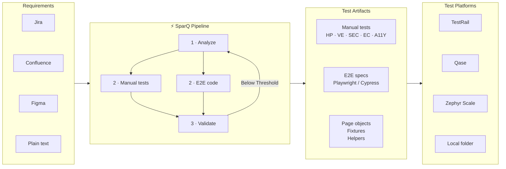

<div align="center">

```
   _____                  ____
  / ___/____  ____ ______/ __ \
  \__ \/ __ \/ __ `/ ___/ / / /
 ___/ / /_/ / /_/ / /  / /_/ /
/____/ .___/\__,_/_/   \___\_\
     /_/  Spar[QA]ssistant  ⚡
```

**The _spark_ your _QA_ pipeline was missing — an AI _assistant_ that writes E2E and manual tests like your best engineer.**

[Getting Started](docs/GETTING-STARTED.md) · [Documentation](docs/) · [Scenarios](docs/SCENARIOS.md) · [Examples](examples/) · [Architecture](docs/ARCHITECTURE.md)

[](https://www.npmjs.com/package/sparq-assistant)
[](https://www.npmjs.com/package/sparq-assistant)
[](https://github.com/STUkh/sparq-assistant)
[](https://nodejs.org/)
[](#)
[](LICENSE)

</div>

<div align="center">

[](#how-it-works)
[](#scenarios)
[](#-what-are-rubrics)

</div>

---
<div align=center>

> **Any requirement source → production-ready tests → any test platform. <br> One command to rule them all**

</div>



<div align=center>

SparQ reads your requirements, generates both manual test cases and E2E automation code that matches your existing codebase patterns, then exports everything to your test management platform with human approval at every checkpoint.

</div>

---

## Quick Start

Install with:
```bash
npx sparq-assistant@latest init
```

Then simply start: 
```bash 
/sparq:generate EP-14
```

That's it. SparQ installed 5 AI agents, 20 skills, and configured your MCP integrations — all in one command. Human approval at every step.

---

## Who Is This For?

🎯 **QA Engineers** — Generate comprehensive test suites from Jira tickets in minutes, not hours. Export directly to TestRail, Qase, or Zephyr Scale. Maintain traceability from requirements to test cases automatically.

💻 **Developers** — Get E2E coverage for your features without writing tests from scratch. SparQ reads your code, detects your patterns, and generates tests that fit your project. Review, approve, commit.

📊 **Engineering Managers** — Add `sparq lint --strict` to your CI pipeline for deterministic test quality gates. SARIF output integrates with GitHub Code Scanning. Track coverage with structured matrices.

> **Prerequisites:** [Node.js >= 22](https://nodejs.org/) and an AI coding assistant ([Claude Code](https://docs.anthropic.com/en/docs/claude-code), [Cursor](https://cursor.sh/), [Codex](https://openai.com/index/codex/) are approved providers but other should also work) · Full setup guide: [docs/SETUP.md](docs/SETUP.md)

---

## Features

- 🔍 **Multi-source requirements**
  Pull acceptance criteria from Jira, specs from Confluence, and UI elements from Figma in a single pass.

- ✍️ **Manual test generation**
  Structured test cases across all categories:
  - **HP** (Happy Path) — core success scenarios and expected user flows
  - **VE** (Validation & Error) — input validation, error states, boundary conditions
  - **SEC** (Security) — authentication, authorization, injection, XSS
  - **EC** (Edge Case) — unusual inputs, race conditions, empty states, limits
  - **A11Y** (Accessibility) — screen reader, keyboard navigation, WCAG compliance

- 🤖 **E2E code generation** <br>
  Playwright or Cypress page objects, fixtures, and specs that match your existing patterns exactly.

- 🔄 **Unified pipeline** <br>
  Manual tests AND E2E automation in one command with `/sparq:generate`.

- 📤 **Multi-TMS export** <br>
  Push test cases to TestRail, Qase, Zephyr Scale, or local folder and publish CI run results back.

- 📏 **18 lint rubrics** <br>
  Like ESLint for test quality — catches flaky patterns, weak locators, missing assertions. Zero AI inference. SARIF output for GitHub Code Scanning. [What are rubrics?](#-what-are-rubrics)

- 🚀 **Parallel test generation** <br>
  Agents generate tests concurrently, splitting work by feature scope and merging results automatically.

- 🧠 **Context-optimized agents** <br>
  Every prompt, skill, and agent carefully tuned for minimal token usage and maximum output quality.

- 🧪 **Test validation** <br>
  Detect broken selectors, stale flows, and coverage gaps after UI changes.

- 🐛 **Bug regression** <br>
  Pass any bug ticket to `/sparq:generate-e2e` — orchestrator auto-detects it and appends an inline regression test with a `REG-{ticket}-{NNN}` ID to the relevant feature spec. Filter with `npx playwright test --grep "REG-"`.

- 🔀 **PR-scoped generation** <br>
  Generate tests only for changed files in a pull request.

- 📊 **Coverage iteration** <br>
  Automatically re-dispatches agents to fill coverage gaps until your target is met (default 80%).

- ✅ **Checkpoint-driven** <br>
  Every phase requires human approval before proceeding — no surprises.

- ⚙️ **Auto-detection** <br>
  Reads `package.json` to identify framework, UI library, test runner, and language.

- 🛡️ **Graceful degradation** <br>
  Jira down? Paste text. Figma unavailable? SparQ greps your codebase for selectors. Never hard-fails.

- 📱 **Viewport matrix** <br>
  Responsive presets for cross-breakpoint testing.

- ⚡ **Performance testing** <br>
  k6, Artillery, Lighthouse CI, Web Vitals — from a single skill.

- 🔄 **Resume from anywhere** <br>
  Interrupted mid-workflow? Resume picks up exactly where you left off.

- 📦 **Zero dependencies** <br>
  Pure Node.js built-ins only.

---

## ✨ What You Get

SparQ generates a clean, best-practice test structure:

```
e2e/
├── pages/
│   ├── login.page.ts
│   ├── checkout.page.ts
│   └── index.ts
│
├── steps/
│   ├── auth.steps.ts
│   ├── checkout.steps.ts
│   └── index.ts
│
├── fixtures/
│   ├── auth.fixture.ts
│   ├── checkout-data.fixture.ts
│   └── index.ts
│
├── specs/
│   ├── auth/
│   │   └── login.spec.ts
│   └── checkout/
│       └── order-flow.spec.ts
│
└── playwright.config.ts
```

- 🧩 **Page objects with `get` accessors** — clean, typed locator properties; no raw selectors scattered in tests
- 🔗 **Shared fixtures & barrel exports** — `index.ts` re-exports everything; import from one place, always
- 🗂️ **Feature-scoped specs** — tests organized by domain, not by file type
- 🔁 **Extends your existing structure in-place** — if `e2e/` already exists, SparQ adds to it without overwriting a single file
- 🗄️ **Metadata isolated to `.sparq/`** — workflow state, artifacts, and coverage data never touch your source tree

> **Cypress projects** follow the same pattern with `cypress/support/pages/`, `cypress/e2e/`, and `.cy.ts` extensions.

---

## Before & After

| Without SparQ | With SparQ |
|:---|:---|
| Read Jira ticket, cross-reference Confluence, open Figma | `/sparq:generate EP-14` — all sources fetched automatically |
| Study existing page objects and fixtures manually | Pattern-matched from your codebase |
| Write page object from scratch | Generated, extending your real base class |
| Write spec file with test cases | 5 test categories: HP, VE, SEC, EC, A11Y |
| Fix selectors, re-run, fix again | Validated against live DOM via Playwright CLI |
| Copy test cases into TestRail manually | `/sparq:export` — direct API push |
| Requirements changed? Rewrite tests | `/sparq:sync EP-14 e2e/specs/auth/` — auto-diffs and updates |
| Found a bug? Write regression test from scratch | `/sparq:generate-e2e BUG-42` — auto-detected as bug ticket, appended inline with `REG-` ID |

---

## 📏 What Are Rubrics?

Rubrics are **automated quality checks that run without AI inference**. Think ESLint rules, but for test quality. Each rubric is a pure JavaScript function — deterministic, auditable, runs in milliseconds.

**Three categories, 18 rubrics total:**

- **FILE rubrics** — flaky test detection, locator quality, assertion coverage, naming conventions, executability checks, regression compliance
- **ARTIFACT rubrics** — handoff schema validation, parallel merge integrity, resume state consistency
- **MARKDOWN rubrics** — coverage completeness, cross-output traceability, requirement coverage, template compliance

**Why this matters:** every finding is traceable to a specific pattern. No probabilistic output. Fully auditable. Runs in CI without model access.

```bash
sparq lint [path]                          # Human-readable output
sparq lint [path] --strict                 # Fail CI on any critical finding
sparq lint [path] --format sarif           # SARIF 2.1.0 for GitHub Code Scanning
sparq lint [path] --threshold 85           # Fail below 85% quality score
sparq lint [path] --coverage-gate 90       # Fail if <90% of files pass
```

---

## Scenarios

| Command | What it does |
|:--------|:-------------|
| `/sparq:generate EP-14` | Manual tests + E2E code in one pipeline |
| `/sparq:generate-e2e EP-198` | E2E tests from requirements |
| `/sparq:validate e2e/specs/auth/` | Detect broken selectors and stale flows |
| `/sparq:generate-e2e BUG-42` | Inline regression test from a bug ticket (`REG-` ID) |
| `/sparq:export` | Push test cases to TestRail, Qase, or Zephyr |

> Covers manual generation, manual-to-E2E conversion, E2E generation, validation, requirement sync, and result publishing. Full walkthrough: **[docs/SCENARIOS.md](docs/SCENARIOS.md)**

---

## Works With Your AI Coding Assistant

SparQ auto-detects your AI editor by scanning for `.cursor/`, `.codex/`, or `.agents/` directories — no config required. All detected editors are installed simultaneously.

| | Claude Code | Cursor | Codex |
|:---|:---:|:---:|:---:|
| **Status** | Full support | Full support | Full support |
| **Invoke** | `/sparq:start` | `/sparq:start` | Ask about SparQ |

```bash
npx sparq-assistant@latest init   # auto-detects all present AI editors
```

---

## How It Works

**5 specialized AI agents** in a phased pipeline — orchestrator classifies your request into one of 6 scenarios, dispatches agents to gather requirements, generate tests, and validate results. Every phase pauses for your approval.

| Phase | Agent | Role |
|:------|:------|:-----|
| Orchestration | `sparq-orchestrator` | Classifies scenario, dispatches agents |
| Phase 1 | `requirements-analyst` | Fetches from Jira, Confluence, Figma |
| Phase 2 | `manual-test-writer` | Generates structured manual tests |
| Phase 2 | `automation-engineer` | Generates E2E code (parallel with above) |
| Phase 3 | `test-validator` | Validates against live DOM, checks coverage |

> Configurable model tiers (Premium/Balanced/Economy). Full architecture: **[docs/ARCHITECTURE.md](docs/ARCHITECTURE.md)**

---

## Built for Context Efficiency

Every token costs money and burns context window. SparQ is architected from the start to use both carefully.

A naive QA pipeline dumps everything into one prompt, runs one giant agent, and hopes for the best. That approach burns through a 200K context window fast — and produces worse results, because a single overloaded agent drifts from its instructions as the conversation grows. SparQ takes the opposite approach: a structured multi-agent pipeline where every agent has exactly one job and receives only the context it needs to do it.

**Focused agents, not monoliths.** The requirements analyst reads requirements. The test writer writes tests. The validator validates. Focused prompts produce sharper outputs at lower token cost — a 15K-token sub-agent doing one thing outperforms a 60K-token general-purpose agent doing four.

**Handoffs, not conversation forwarding.** When the orchestrator dispatches a sub-agent, it sends a structured handoff capped at 3,000 tokens (~12KB) — not the full conversation history. Each agent starts fresh with only the data it needs. This is the single biggest lever for keeping output quality high across long workflows.

**Hard limits that protect quality.** The orchestrator enforces concrete work-item caps: 40 requirements per workflow, 30 manual tests per batch, 20 E2E tests per batch. The orchestrator warns at 120K accumulated tokens and hard-stops at 150K. These limits aren't arbitrary — they're tuned to leave enough room for multi-phase workflows without letting any single phase crowd out the next.

**Prompt budget discipline baked in.** Agents and skills are written using lists over tables (roughly 30–40% token savings), XML-tagged sections for precise extraction, and mermaid diagrams instead of ASCII art for flows. The `/sparq:prompt-optimizations` skill is a living reference for compression patterns used throughout the codebase.

**Model assignment by task type.** Opus runs requirements analysis and orchestration — where nuanced judgment and multi-step reasoning matter most. Sonnet runs test writing and validation — where volume and speed dominate. Assigning the wrong model wastes tokens and degrades results.

**Quality gates without LLM inference.** The 18 rubrics in `sparq lint` are pure JavaScript — deterministic, auditable, and running in milliseconds. Checking whether a test suite covers all 5 categories, uses stable locators, or follows naming conventions requires zero model calls. No tokens spent on output you could verify with a regex.

The end result: faster turnaround, more consistent output, and lower API costs on every workflow run.

---

## Supported Stacks

| Category | Supported |
|:---------|:----------|
| **AI Platforms** | Claude Code, Cursor, Codex, ... (auto-detected) |
| **Frameworks** | Vue, React, Angular, Svelte (auto-detected) |
| **UI Libraries** | PrimeVue, Vuetify, Quasar, Element Plus, MUI, Ant Design, Headless UI |
| **E2E Runners** | Playwright (full generation), Cypress (full generation) |
| **Languages** | TypeScript, JavaScript (auto-detected) |
| **TMS Providers** | TestRail, Qase, Zephyr Scale, Local folder |
| **OS** | macOS, Linux, Windows |

---

## CLI Commands

```bash
npx sparq-assistant init             # Install agents, skills, MCP configs
npx sparq-assistant doctor           # Verify installation and MCP connections
npx sparq-assistant lint [path]      # Deterministic quality rubrics (SARIF, CI-safe)
npx sparq-assistant update           # Update to latest definitions
npx sparq-assistant uninstall        # Remove all SparQ files
```

> Also: `clean`, `help`, `coverage`. Global flags: `--dry-run`, `--workspace`. Full reference: **[docs/DAILY-USAGE.md](docs/DAILY-USAGE.md)**

---

## Configuration

After `sparq-assistant init`, settings live in `sparq.config.json` — auto-generated by the setup wizard. Configures sources (Jira, Confluence, Figma), test output (directory, TMS provider), and preferences (model tier, checkpoint level).

> Most users never edit this manually. Full schema: **[docs/SETUP.md](docs/SETUP.md)**

---

## MCP Integrations

Optional MCP servers — Atlassian (Jira + Confluence), Figma, TestRail, Qase, Zephyr Scale. All auto-configured during `sparq init`. Playwright uses CLI directly (no MCP server needed).

> When unavailable, SparQ degrades gracefully — falls back to user input, local files, or codebase analysis. Details: **[docs/SETUP.md](docs/SETUP.md)**

---

## Environment Variables

MCP servers authenticate via environment variables — credentials stay in your shell, never in config files (which store only `${PLACEHOLDER}` syntax resolved at runtime).

**Which servers need setup:**

- **Atlassian** (Jira + Confluence) and **Figma** — OAuth only; Claude Code handles auth on first connect. No env vars needed.
- **Playwright** — no credentials needed.
- **TestRail** — `TESTRAIL_BASE_URL`, `TESTRAIL_USERNAME`, `TESTRAIL_API_KEY`
- **Qase** — `QASE_API_TOKEN`
- **Zephyr Scale** — `ZEPHYR_API_TOKEN`, `ZEPHYR_PROJECT_KEY`
**Recommended storage (most secure → quickest):**

1. **macOS Keychain / Windows Credential Manager** — OS-encrypted. Best for personal machines.
2. **1Password / Bitwarden CLI** — team-friendly, centralised, with audit trail and rotation.
3. **`direnv` + `.envrc`** — project-scoped, auto-loads on `cd`. Recommended for teams.
4. **Isolated secrets file** — `~/.sparq-secrets` with `chmod 600`, sourced in shell profile.
5. **`.env` file** — never commit it (already in `.gitignore`); load with `source .env && claude`.

> **Never commit real credentials.** Only `${PLACEHOLDER}` values belong in `mcp/` files.
> Copy `.env.example` → `.env`, fill in your values.

**CI/CD:** set secrets in GitHub Actions (Settings → Secrets) or GitLab CI (Settings → Variables). Add `SPARQ_NO_UPDATE_CHECK=1` to skip the update check in pipelines.

> Verify all MCP credentials: `npx sparq-assistant doctor` · Full credential guide: **[docs/SETUP.md](docs/SETUP.md)**

---

## 📚 Documentation

### Core Guides

- 🚀 **[Getting Started](docs/GETTING-STARTED.md)** — Install SparQ and run your first workflow. Learn how SparQ auto-detects your project structure, walks you through 3 approval gates, and generates tests that match your exact patterns. Includes Jira-based, plain text, and bug regression walkthrough.

- ⚙️ **[Setup](docs/SETUP.md)** — Advanced MCP configuration, OAuth flows, CI/CD integration, and troubleshooting. Everything beyond the basic install.

- 📋 **[Daily Usage](docs/DAILY-USAGE.md)** — The QA Engineer's command reference. Decision trees for "which command do I run?", S4-vs-S5 disambiguation, quick-paste workflows, and tips for power users.

- 🗺️ **[Scenarios](docs/SCENARIOS.md)** — All scenarios mapped out with phase walkthroughs, checkpoint rules, and a composability matrix showing which workflows chain into full pipelines.

### Deep Dives

- 🏗️ **[Architecture](docs/ARCHITECTURE.md)** — How 5 specialized AI agents orchestrate test generation. Agent hierarchy, MCP integration map, project auto-detection rules, and data flow from requirement to generated code.

- ⚠️ **[Limitations](docs/LIMITATIONS.md)** — Honest trade-offs and graceful degradation. MCP servers optional with documented fallbacks. Framework maturity levels, batch limits, and practical workarounds.

---

## Examples

- [Unified generate](examples/s1s2-unified-generate.md) — Jira to manual tests + E2E in one flow
- [E2E generation — feature ticket](examples/s3-feature-ticket.md) — Jira to Playwright tests
- [Bug regression](examples/s3-bug-ticket.md) — Bug ticket to regression spec

> More examples covering all scenarios: **[examples/](examples/)**

## Contributing

Contributions welcome. Please open an issue or submit a PR.

```bash
npm run check    # lint + test — run before every commit
```

## License

[MIT](LICENSE)
