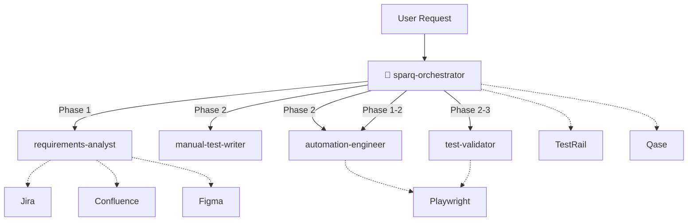

<div align="center">

# SparQ Assistant

**QA testing framework for Claude Code** -- generate manual tests and E2E suites (Playwright or Cypress)<br>from Jira, Figma, and Confluence requirements.

[Getting Started](docs/GETTING-STARTED.md) · [Documentation](docs/) · [Scenarios](docs/SCENARIOS.md) · [Examples](examples/) · [Architecture](docs/ARCHITECTURE.md)

[](https://www.npmjs.com/package/sparq-assistant)
[](https://github.com/sparq-assistant/sparq-assistant/actions/workflows/ci.yml)
[](LICENSE)
[](https://nodejs.org/)
[](#)

</div>

---

## What is SparQ?

A QA toolkit that plugs into [Claude Code](https://docs.anthropic.com/en/docs/claude-code) as agents and skills. Point SparQ at a Jira ticket, Figma design, or existing manual test case and it generates comprehensive test suites -- manual or automated -- following your project's patterns. Every step includes a human checkpoint so you stay in control.

## Features

- 🔍 **Multi-source requirements** -- pull acceptance criteria from Jira, specs from Confluence, and UI elements from Figma in a single pass
- ✍️ **Manual test generation** -- structured test cases across 5 categories:
  - **HP** (Happy Path) -- core success scenarios and expected user flows
  - **VE** (Validation & Error) -- input validation, error states, boundary conditions
  - **SEC** (Security) -- authentication, authorization, injection, XSS
  - **EC** (Edge Case) -- unusual inputs, race conditions, empty states, limits
  - **A11Y** (Accessibility) -- screen reader, keyboard navigation, WCAG compliance
- 🤖 **E2E code generation** -- Playwright or Cypress page objects, fixtures, and specs that match your existing patterns exactly
- 🔄 **Unified pipeline** -- generate manual tests AND E2E automation in one command with `/sparq:generate`
- 🧪 **Test validation** -- detect broken selectors, stale flows, and coverage gaps after UI changes
- 🐛 **Bug regression** -- generate focused regression specs from bug tickets, tagged `@regression`
- 📤 **Multi-TMS export** -- push to TestRail, Qase, or local folder
- ✅ **Checkpoint-driven** -- every phase requires human approval before proceeding
- ⚙️ **Auto-detection** -- reads `package.json` to identify framework, UI library, test runner, and language
- 📦 **Zero dependencies** -- pure Node.js built-ins only

### Supported Stacks

| Category | Supported |
|----------|-----------|
| **Frameworks** | Vue, React, Angular, Svelte (auto-detected) |
| **UI Libraries** | PrimeVue, Vuetify, Quasar, Element Plus, MUI, Ant Design, Headless UI |
| **E2E Runners** | Playwright (full generation), Cypress (full generation) |
| **Languages** | TypeScript, JavaScript (auto-detected) |

## Quick Start

> **Prerequisites:** [Node.js >= 22](https://nodejs.org/) and [Claude Code](https://docs.anthropic.com/en/docs/claude-code) CLI installed and authenticated.

```bash
npx sparq-assistant@latest init
```

> **Note:** `sparq.config.json` is auto-generated by the setup wizard — you don't need to write it manually. The wizard detects your framework, test runner, and project structure from `package.json`.

Restart Claude Code to load MCP servers, then configure your sources in `sparq.config.json`.

Default guided entry (recommended):

```
/sparq:start
```

Direct generation example:

```
/sparq:generate EP-14
```

Low-cost prompt quality loop for Claude Code users (skills-first):

```
/sparq:eval s6-bug-regression --strict --model haiku
/sparq:improve s6-bug-regression --model haiku
/sparq:baseline-promote s6-bug-regression
```

If you run strict eval in `mock` mode for a cheap check, switch to a generation-capable model (for example
`--model haiku`) before running `/sparq:improve`.

Usage flow mental model:

| Lane | Commands |
|------|----------|
| Generate | `/sparq:generate-manual`, `/sparq:generate-e2e`, `/sparq:generate`, `/sparq:manual-to-e2e` |
| Maintain | `/sparq:validate`, `/sparq:sync`, `/sparq:regression`, `/sparq:export` |

> Full setup including MCP server configuration: [docs/SETUP.md](docs/SETUP.md)

## Documentation Guide

New to SparQ? Read the docs in this order:

1. **[GETTING STARTED](docs/GETTING-STARTED.md)** -- Beginner's guide: concepts, installation, first workflow
2. **[SETUP](docs/SETUP.md)** -- Advanced installation, MCP configuration, troubleshooting
3. **[DAILY-USAGE](docs/DAILY-USAGE.md)** -- Common workflows, decision tree, tips
4. **[SCENARIOS](docs/SCENARIOS.md)** -- Detailed phase walkthroughs for each scenario
5. **[ARCHITECTURE](docs/ARCHITECTURE.md)** -- Technical deep dive, agent pipeline, data flow
6. **[LIMITATIONS](docs/LIMITATIONS.md)** -- Known constraints and workarounds

## Scenarios

| Scenario | Command | Description |
|----------|---------|-------------|
| Unified generate | `/sparq:generate EP-14` | Manual tests + Playwright E2E in one pipeline |
| Manual tests | `/sparq:generate-manual EP-14` | Structured test cases across 5 categories |
| Manual to E2E | `/sparq:manual-to-e2e path/to/tests.md` | Convert existing manual tests to Playwright |
| E2E generation | `/sparq:generate-e2e EP-198` | Playwright tests directly from requirements |
| Test validation | `/sparq:validate e2e/specs/auth/` | Validate tests against current UI and codebase |
| Requirement sync | `/sparq:sync EP-14 e2e/specs/auth/` | Sync tests with updated requirements |
| Bug regression | `/sparq:regression BUG-42` | Focused regression spec from a bug ticket |
| Refactor | `/sparq:refactor --from "old" --to "new"` | Refactor selectors/patterns across E2E tests |
| Export | `/sparq:export` | Push test cases to TestRail, Qase, or local folder |
| Resume | `/sparq:resume` | Resume an interrupted workflow |

> Detailed walkthroughs: [docs/SCENARIOS.md](docs/SCENARIOS.md) · [examples/](examples/)

## CLI Commands

```bash
npx sparq-assistant init        # Install agents, skills, and MCP configs
npx sparq-assistant update      # Update to latest definitions
npx sparq-assistant doctor      # Verify MCP connections and config
npx sparq-assistant clean       # Remove stale artifacts from .sparq/
npx sparq-assistant eval        # Run eval cases (strict by default)
npx sparq-assistant improve     # Bounded improve loop for failing evals
npx sparq-assistant baseline    # Baseline promotion commands
npx sparq-assistant tune        # Apply/revert model tier guidance
npx sparq-assistant uninstall   # Remove all SparQ files
npx sparq-assistant help        # Show usage
```

Default reliability-first eval flow:
1. `npx sparq-assistant eval <case|--all> --strict`
2. `npx sparq-assistant improve <case|--all>` (prefer `--model haiku` when latest strict run used `mock`)
3. `npx sparq-assistant baseline promote <case|--all>` after 2 consecutive clean strict passes
4. Advanced/service primitives are available but hidden from default help: `npx sparq-assistant help advanced`

## Architecture



The orchestrator classifies each request into one of six scenarios, dispatches agents through a phased workflow, and presents checkpoints at every decision point. Artifacts flow through the `.sparq/` working directory.

**Model tiers:** Configurable via `preferences.modelTier` or `/sparq:tune`. Default (premium): orchestrator, requirements-analyst, and automation-engineer use Claude Opus; manual-test-writer and test-validator use Claude Sonnet. Balanced: all Sonnet. Economy: all Haiku.

## MCP Integrations

| MCP Server | Purpose | Used For |
|------------|---------|----------|
| **Atlassian** | Jira tickets, Confluence pages | Requirements gathering |
| **Figma** | Design context, component metadata | Selector derivation, UI inventory |
| **TestRail** | Test case creation, section management | Exporting test cases |
| **Qase** | Test case creation, suite management | Exporting test cases |
| **Playwright** | Browser automation, DOM inspection | Test validation, selector verification |

MCP configs are stored in `mcp/` and referenced from your Claude Code MCP settings. Each source can be enabled/disabled in `sparq.config.json`.

## Configuration

After `sparq-assistant init`, configure your project in `sparq.config.json`:

```jsonc
{
  "version": "1.0.0",
  "project": {
    "testDir": "e2e",
    "sourceRoot": "src",
    "componentFileExtensions": [".vue"]
  },
  "sources": {
    "jira": { "enabled": true, "projectKey": "EP" },
    "confluence": { "enabled": true, "spaceKey": "PROJ" },
    "figma": { "enabled": true },
    "local": { "enabled": true, "requirementsDir": "docs/specs" }
  },
  "outputs": {
    "tms": { "provider": "testrail" }
  },
  "preferences": {
    "checkpointLevel": "full",
    "maxClarifications": 2,
    "modelTier": "premium"
  }
}
```

> Full schema and options: [docs/SETUP.md](docs/SETUP.md)

## Documentation

- [docs/GETTING-STARTED.md](docs/GETTING-STARTED.md) -- Beginner's guide: concepts, installation, first workflow
- [docs/ARCHITECTURE.md](docs/ARCHITECTURE.md) -- System architecture, agent hierarchy, data flow
- [docs/SCENARIOS.md](docs/SCENARIOS.md) -- Detailed scenario walkthroughs and decision tree
- [docs/SETUP.md](docs/SETUP.md) -- Advanced installation, MCP configuration, troubleshooting
- [docs/DAILY-USAGE.md](docs/DAILY-USAGE.md) -- Common workflows, tips, output files
- [docs/LIMITATIONS.md](docs/LIMITATIONS.md) -- Known constraints and workarounds

## Examples

| Example | Scenario |
|---------|----------|
| [s1s2-unified-generate.md](examples/s1s2-unified-generate.md) | Forgot Password: Jira to manual tests AND E2E in one flow |
| [s1-manual-creation.md](examples/s1-manual-creation.md) | Forgot Password: Jira to manual test cases |
| [s2-manual-to-e2e.md](examples/s2-manual-to-e2e.md) | Tenant selection: manual test to Playwright |
| [s3-e2e-generation.md](examples/s3-e2e-generation.md) | User creation: Jira to Playwright tests |
| [s4-test-sync.md](examples/s4-test-sync.md) | Login tests: validated after Figma UI update |
| [s5-test-refresh.md](examples/s5-test-refresh.md) | Login tests: refreshed after requirements added |
| [s6-bug-regression.md](examples/s6-bug-regression.md) | Checkout bug: Jira bug ticket to Playwright regression spec |

## Contributing

Contributions welcome. Please open an issue or submit a PR.

```bash
npm run check    # lint + test -- run before every commit
```

## License

[UNLICENSED](LICENSE)
