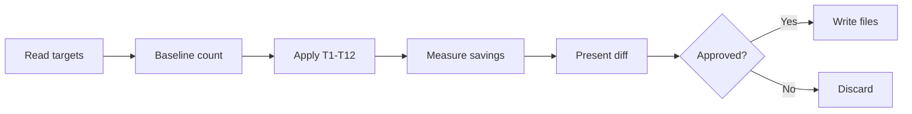

# Prompt Optimization

Apply 12 token-reduction techniques to agent, skill, and reference files while preserving semantic completeness.
This is a service primitive, not part of the default eval/improve loop.

## Input

```
/sparq:optimize <target>
```

Targets:
- File path: `claude/agents/sparq-automation-engineer.md`
- `--agents` — all `claude/agents/*.md`
- `--skills` — all `claude/skills/*/SKILL.md`
- `--references` — all `claude/skills/sparq-shared/references/*.md`
- `--all` — agents + skills + references

<workflow>

## 1. Parse Targets

Resolve argument to file list. Validate existence.

## 2. Measure Baseline

Count lines and words per file as token proxy.

## 3. Apply Optimization Passes (T1–T12)



Techniques:

- **T1 ASCII→Mermaid**: Replace ASCII art, box diagrams, flow charts with mermaid
- **T2 Tables→Lists**: Convert markdown tables to bulleted lists (~30-40% savings)
- **T3 Filler removal**: Strip zero-meaning words — just, simply, basically, essentially, actually, really, very, quite, rather, of course, note that, please note, it should be noted, keep in mind, it is important to
- **T4 Redundancy consolidation**: Merge duplicate rules across sections into single authoritative location
- **T5 Verbose→Concise**: Condense multi-sentence explanations to single dense sentences
- **T6 Comment removal**: Remove inline comments restating what structure already shows
- **T7 XML boundaries**: Replace ambiguous markdown section boundaries with XML tags (`<rules>`, `<constants>`, `<workflow>`)
- **T8 Example compression**: Trim few-shot examples to minimal representative form — preserve pattern, strip padding
- **T9 Cross-section dedup**: Find instructions repeated across workflow + done_criteria + rules — keep one canonical instance
- **T10 Reference extraction**: Replace inlined content (>5 lines) duplicated from shared references with `@path`
- **T11 Frontmatter gerunds**: Rewrite YAML `description` to gerund form for trigger accuracy
- **T12 Meaningful-words-only**: Rewrite prose to maximize semantic density — every word must carry meaning

## 4. Measure Result

Count lines and words post-optimization. Calculate savings percentage.

## 5. Present Diff

Per-file output:
- Technique labels (T1–T12) annotating each change
- Before/after word count
- Savings percentage
- Cumulative savings across all targets

## 6. Apply on Approval

CHECKPOINT: write optimized files only after user confirmation.

**Protected sections**: Before applying dedup transforms (T4, T8, T9), call `getProtectedSections()` from `eval-state.mjs`. Skip dedup on any section listed for the current agent — these were added by `/sparq:eval-tune` and must not be consolidated or removed.

**Atomic writes**: Use tmp-then-rename pattern (`atomicWriteSync` from `eval-reflect.mjs`) for each file write to prevent corruption on failure. If any write fails, report which succeeded and which failed.

**Set optimize marker**: After writing modified files, call `setOptimizeMarker()` from `eval-state.mjs`. This creates a gate requiring re-eval before committing.

</workflow>

## Structural Constraints

Immutable during optimization:
- `<done_criteria>` content — completion semantics unchanged (items may be reworded for density, never removed or weakened)
- YAML frontmatter identity fields (`name`, `model`, `color`)
- `@path` references — verify targets exist post-optimization
- Content-bearing few-shot examples — compress, never remove
- Handoff entries — stay inside canonical section (`<handoff>` or `## Handoff`)
- **Tune-protected content**: rules or examples recently added by `/sparq:eval-tune` (identified by being rubric-aligned — directly addressing a specific rubric check) must NOT be removed by T4/T8/T9 dedup. These exist to fix specific eval failures. When in doubt, keep the content.

Limits:
- Agents under 300 lines post-optimization
- Files near 300 lines: extract shared logic to `claude/skills/sparq-shared/references/` first, then optimize

<done_criteria>
1. All target files read and baseline word count recorded
2. All 12 techniques (T1–T12) evaluated per file
3. Optimized version preserves all semantic content and required sections
4. YAML frontmatter identity fields unchanged
5. `<done_criteria>` content unchanged (word-for-word)
6. Savings summary printed (word count before/after, percentage)
7. Changes applied only after user approval
8. Optimize marker set via `setOptimizeMarker()` — re-eval required before committing
</done_criteria>

## References

- `claude/rules/agents.md` — structural rules, prompt optimization guidelines
- `claude/rules/skills.md` — skill structure requirements
- `claude/skills/sparq-shared/references/handoff-schema.md` — handoff format (immutable)
- `bin/lib/commands/eval-state.mjs` -- `getProtectedSections()`, `setOptimizeMarker()`, `checkOptimizeGate()`

## Examples

```
/sparq:optimize claude/agents/sparq-automation-engineer.md
-> Baseline: 287 lines, ~2100 words
-> T2: 2 tables → lists (-45 words)
-> T3: 18 filler words removed
-> T5: 4 verbose blocks condensed (-62 words)
-> T9: 3 cross-section duplicates consolidated (-38 words)
-> Result: 254 lines, ~1955 words (6.9% savings)
-> CHECKPOINT: present diff for approval
```

```
/sparq:optimize --agents
-> Optimizes all 5 agent files sequentially
-> Per-file diffs + cumulative savings report
```

```
/sparq:optimize --all
-> Agents + skills + references
-> Full optimization pass with cumulative summary
```

After optimization, run `/sparq:eval --all --strict --model haiku` (or
`/sparq:improve --all --model haiku`) to verify no prompt regression, then
`/sparq:baseline-promote --all` when policy allows.
