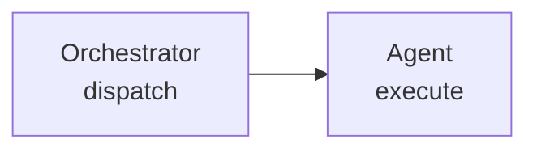

# Prompt Optimizations

> Intelligence is not the bottleneck. Right context at right time is.

Advanced techniques for authoring SparQ agents, skills, and references. For project standards (lists > tables, Mermaid > ASCII, XML section tags), see CLAUDE.md directly.

---

## When to Use

- Writing or updating SKILL.md / agent `.md` files
- Refining CLAUDE.md instructions or `.claude/rules/` scoped rules
- Designing multi-agent dispatch prompts (orchestrator → sub-agents)
- Debugging poor output (verbosity, hallucination, drift)
- Optimizing token costs across the 5-agent pipeline
- Choosing data formats for structured prompt content

---

## Token Economics

Output tokens cost 3–5x input. Precise input reduces expensive output.

### Budget Hierarchy

1. **Hard constraints first** — "5 bullets, max 15 words each" beats "be concise"
2. **Specify format** — match prompt structure to desired output
3. **Eliminate filler** — every token earns its place
4. **Abbreviate known terms** — E2E, MCP, TMS, PW, CY, API, CI (never expand well-known acronyms)

### Quantified Constraints

```markdown
// Bad — vague
"Provide a brief summary of findings"

// Good — quantified
"Summary: 3 bullets, max 12 words each"
```

### Filler Elimination

```markdown
// 12 tokens for a 1-token intent
"Could you please provide a detailed explanation of..." → "Explain..."

// 8 tokens for a 2-token intent
"I would like you to create a..." → "Create a..."
```

**Rule:** If intent is N tokens, instruction should be ~N tokens.

### Stop Patterns

Explicit stop signals prevent runaway output:

- End with format constraints: "Output: [code only]"
- Specify exclusions: "No explanations. No comments."
- Use XML section tags as natural boundaries (`<done_criteria>`, `<handoff>`)

See [token-budgeting.md](references/token-budgeting.md) for cost model and compression benchmarks.
For runtime workflow budgets, see `claude/skills/sparq-shared/references/token-budget.md`.

---

## Context Engineering

Context engineering supersedes prompt engineering. Right context, right time.

### Conditional `<references>` — SparQ's JIT Pattern

SparQ agents use conditional `<references>` sections to load only what the current task needs. This is the project's primary token-saving mechanism (~4–8K saved per dispatch):

```xml
<!-- Simplified from sparq-automation-engineer.md -->
<references>
Load at startup:
- handoff-schema.md, pattern-adherence.md, e2e-common-patterns.md

Read only when e2e.framework: 'playwright':
- playwright-patterns.md, playwright-mcp-tools.md, playwright-assertions.md

Read only when generating >= 10 test cases:
- context-anchoring.md

Read only when dispatched with inputType: "bug" (S3 bug mode):
- test-generation-patterns.md (bug ticket section)
</references>
```

**Rule:** If content is used in <30% of dispatches, make it conditional. If >70%, load at startup.

### Anti-Patterns (summary)

- **Poisoning** — outdated docs corrupt reasoning
- **Distraction** — irrelevant info wastes tokens and focus
- **Confusion** — conflicting information creates ambiguity
- **Clash** — contradictory rules with no stated priority

See [context-engineering.md](references/context-engineering.md) for deep dive, sliding window strategy, multi-agent context rules, and priority resolution.

---

## Claude 4.6 Behavior

Guidance specific to Opus/Sonnet 4.6 powering SparQ agents.

### Direct Lookup Over Reasoning Prompts

Claude 4.6 reasons effectively without being told to. Use structured lookups instead:

```markdown
// Bad — anti-laziness prompt causes runaway thinking
"Be thorough and think carefully about which scenario to classify"

// Good — direct lookup table (simplified from orchestrator)
<classification_rules>
1. Manual test cases as input → S2
2. Existing test files to validate → S4
3. Keywords: automated, E2E, Playwright, Cypress → S3
4. Reqs + sync/update intent → S5
5. Bug ticket + regression keywords → S3 (bug mode)
6. Default → S1
</classification_rules>
```

The orchestrator's `<classification_rules>` is an example — a direct lookup eliminates reasoning ambiguity.

### Conditional Loading Over Blanket Mandates

```markdown
// Bad — loads everything regardless of scenario
"Read all reference files at startup"

// Good — conditional loading (real pattern from automation-engineer)
"Read only when e2e.framework: 'playwright': playwright-patterns.md
Read only when generating >= 10 test cases: context-anchoring.md"
```

Saves ~4–8K tokens per dispatch. See "Context Engineering" section above.

### Hard Rules: Safety Invariants Only

Reserve MUST/NEVER/ALWAYS for genuine invariants:

- **Justified:** "NEVER share Tier 1 write targets between parallel tasks" (data corruption risk)
- **Justified:** "Sub-agents cannot spawn other sub-agents" (architecture invariant)
- **Unjustified:** "You MUST use the Grep tool for ALL searches" (rigid, reduces tool selection quality)

### Compressed Descriptions

Agent opening lines demonstrate good compression:

```markdown
// Verbose — 42 tokens
"The test validator agent is responsible for validating existing
E2E test suites against the current codebase, requirements, and
UI designs to detect broken selectors and stale flows."

// Actual (sparq-test-validator.md line 10) — 22 tokens
"Validate existing test suites against current requirements, UI designs,
and application code. Detect broken selectors, navigation flow mismatches."
```

47% reduction by eliminating filler ("is responsible for," "in order to") and merging redundant phrases.

---

## Data Format Selection

Research-backed format effectiveness for LLM consumption (source: ImprovingAgents study).

### Format Rankings (accuracy, descending)

- **Markdown-KV** — 60.7% accuracy, best for structured info (default choice)
- **INI** — 55.7%, strong at low token cost
- **YAML** — 54.7%, good for hierarchical data
- **JSON** — 52.3%, high token cost from syntax characters
- **Markdown-Table** — 51.9%, 9 points worse than Markdown-KV
- **CSV** — 44.3%, avoid for agent prompts

### Decision Guide

- **Config/settings** — Markdown-KV or YAML
- **Structured data in prompts** — Markdown-KV (bold keys + values)
- **API payloads / tool params** — JSON (protocol requirement)
- **Multi-column comparison** — Markdown-KV with inline attributes (never tables)
- **Hierarchical data** — YAML or nested Markdown lists

### Markdown-KV Pattern (Preferred)

```markdown
- **Name**: requirements-analyst
- **Model**: opus
- **Role**: Extract and structure requirements from sources
- **Dispatch**: Phase 1 only, max 40 requirements
```

See [format-research.md](references/format-research.md) for full data and migration examples.

---

## Prompt Compression

Reduce token count without losing semantic meaning.

### Compression Techniques (with real SparQ examples)

**Merge** — combine sentences saying the same thing:
```markdown
// Before (orchestrator draft) — 3 sentences, same idea
"The orchestrator classifies scenarios. Classification determines which
agents to dispatch. The scenario type controls the entire workflow."
// After — 1 sentence
"Orchestrator classifies S1–S6, determining agent dispatch and workflow."
```

**Abstract** — one example + rule beats three:
```markdown
// Bad — full handoff examples for all 4 sub-agents (60+ lines)
// Good — one example + schema reference
"All handoffs follow handoff-schema.md. Example: [single handoff].
Same structure for all sub-agents."
```

**Reference** — "See X" beats inlining X:
```markdown
// Bad — 15-line severity definition inline
// Good
"Severity: Critical/Warning/Info per validation-checklist.md"
```

**Omit defaults** — only state non-obvious behavior:
```markdown
// Bad — stating what Claude already knows
"Use import statements, not require. Use named exports."
// Good — state only SparQ-specific convention
"Follow bin/lib/ patterns. See constants.mjs for conventions."
```

### Config Summary: Compression Case Study

The orchestrator's `<config_summary_format>` compresses a full `sparq.config.json` (50+ fields) into 4 lines for sub-agent dispatch:

```
Project: myapp | sourceRoot: src | testDir: e2e | extensions: .vue,.tsx
Framework: playwright | TypeScript: yes | Sources: Jira=EP Confluence=TEAM
E2E: pages=e2e/pages specs=e2e/specs | Base: AbstractPage | Fixtures: fixtures/index.ts
Locators: data-testid,role,text | Checkpoint: standard | Smoke: true | Tier: premium
```

~120 tokens vs ~400 for the raw JSON. Each sub-agent gets exactly what it needs — 70% reduction.

---

## Mermaid Optimization

### Token-Efficient Labels




### Authoring Checklist

- Mention diagram type explicitly: "Create a flowchart showing..."
- Use Mermaid terminology (node, edge, subgraph)
- Avoid quotes in labels (adds tokens; only needed for special chars)
- Use `<br/>` for multi-line labels
- Prefer `flowchart` over `graph` (more features)
- Keep node count under 15 per diagram

### Diagram Type Selection

- **Process/flow** — `flowchart`
- **Time sequence** — `sequenceDiagram`
- **Data model** — `erDiagram` or `classDiagram`
- **State machine** — `stateDiagram-v2`
- **Timeline** — `gantt`
- **Hierarchy** — `mindmap`

---

## Structured Output Efficiency

### XML Tags for Prompt Sections

Claude responds well to XML-tagged organization (SparQ convention):

```xml
<classification_rules>
S1: Manual test cases from requirements
S2: Manual-to-E2E conversion
S3: E2E generation from requirements
</classification_rules>

<done_criteria>
- All test cases have unique TC-IDs
- Coverage matrix maps every REQ to TCs
- Smoke verify passes
</done_criteria>
```

### Template Shaping

Match prompt structure to desired output:

```markdown
// Bad — prose prompt gets prose response
"Can you explain the handoff format and show me what it looks like?"

// Good — structured prompt gets structured response
"Handoff format:
1. Required fields: [list]
2. Optional fields: [list]
3. Size limits: [from token-budget.md]"
```

---

## Pre-Prompt Audit Checklist

Run before finalizing any prompt, skill, or agent file:

- [ ] **No duplication** — repeats CLAUDE.md rules? Remove
- [ ] **Quantified constraints** — limits explicit? (word count, bullet count, batch size)
- [ ] **JIT over pre-load** — all context necessary right now? Defer what can wait
- [ ] **No anti-laziness** — removed "be thorough," "think carefully"?
- [ ] **Format matches output** — prompt structure mirrors desired response?
- [ ] **Hard rules justified** — MUST/NEVER reserved for safety invariants only?
- [ ] **Examples minimal** — one example + pattern, not three redundant?
- [ ] **Compression applied** — merged synonymous sentences? Removed filler?
- [ ] **Context current** — no stale information that could poison results?
- [ ] **Under budget** — agents under 300 lines? SKILL.md under 500? References under 250?
- [ ] **XML tags present** — `<done_criteria>`, `<references>`, `<handoff>` sections exist?

---
