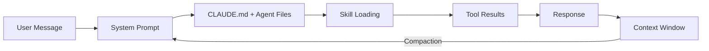
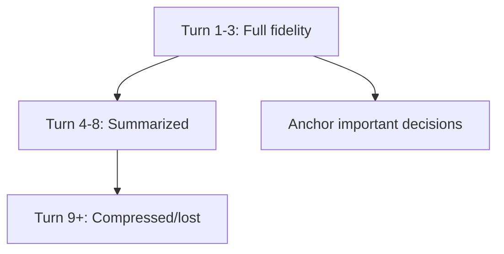

# Context Engineering Deep Dive

> Context engineering > prompt engineering. Intelligence is not the bottleneck.

---

## Context Lifecycle

How context flows through a SparQ session:



**Injection Points:**

- **System prompt** — always loaded (CLAUDE.md, MEMORY.md, `.claude/rules/`)
- **Skill invocation** — on-demand via `/sparq:*` skills
- **Tool results** — file reads, Grep/Glob, MCP responses
- **User messages** — instructions, Jira tickets, feature descriptions
- **Agent outputs** — sub-agent handoffs via structured schema

**Pruning Points:**

- **Auto-compaction** — system compresses older messages near context limits
- **Agent isolation** — sub-agents have separate context windows
- **Reference by path** — `@path` syntax instead of inline content

---

## JIT Loading Patterns

### Three JIT Layers in SparQ

SparQ implements JIT loading at three levels, each saving tokens:

**Layer 1: Skill invocation** (~2–3K per skill, loaded on demand)
```markdown
// Pre-loaded (always in context via CLAUDE.md): ~10.5K
// JIT-loaded (invoked only when needed):
- /sparq:generate — full pipeline (~3K tokens)
- /sparq:validate — validation workflow (~2.5K)
- /sparq:generate-e2e — S3 workflow (feature/bug auto-detection, ~2K)
```

**Layer 2: Conditional `<references>` in agents** (~4–8K saved per dispatch)
```xml
<!-- Simplified from sparq-automation-engineer.md -->
<references>
Load at startup:
- handoff-schema.md, pattern-adherence.md, e2e-common-patterns.md

Read only when e2e.framework: 'playwright':
- playwright-patterns.md, playwright-cli-tools.md, playwright-assertions.md

Read only when generating >= 10 test cases:
- context-anchoring.md

Read only when dispatched with inputType: "bug" (S3 bug mode):
- test-generation-patterns.md (bug ticket section)
</references>
```

A Playwright S3 dispatch with 8 tests loads 6 refs. A Cypress S3 bug mode dispatch loads 4 refs. Same agent, different context.

**Layer 3: File path vs inline content**
```markdown
// Bad — 150 tokens of inline description
"The validation module at validation-checklist.md contains..."

// Good — 12 tokens, agent reads on demand
"Validation rules: see validation-checklist.md"
```

**Rule:** If content is used in <30% of dispatches, make it conditional. Inline only when <5 lines and exact syntax matters.

---

## Sliding Window Strategy

### Managing Long Conversations

As conversations grow, earlier context compresses or drops:



**Strategies:**

- **Anchor decisions** — restate in later messages: "As decided, using Playwright with data-testid selectors"
- **Re-state constraints** — when compacted: "Remember: max 20 E2E specs per batch"
- **Use todo list** — TodoWrite persists across compaction
- **Agent isolation** — spawn sub-agents for research; results return, full context stays in their window

### Summarization Triggers

Summarize when:

- Conversation exceeds 15 turns
- Switching to a different scenario (S1→S4)
- Agent research completed (synthesize findings)
- Before dispatching sub-agents (provide condensed context)

---

## Multi-Agent Context

### What to Include in Agent Dispatch

```markdown
// Good — specific, bounded context
"Search e2e/specs/ for all tests using LoginPage.
Return: file paths, test names, selectors used."

// Bad — unbounded, vague
"Look at the test suite and tell me about it."
```

**Include:**

- Specific search scope (directories, file patterns)
- What to return (structured format matching handoff schema)
- Relevant constraints (batch limits, selector convention)
- File paths discovered in prior exploration

**Exclude:**

- Full CLAUDE.md (agent has its own instructions)
- Background context irrelevant to the sub-task
- Duplicated context from parallel agents

### Avoiding Cross-Agent Duplication

When dispatching parallel agents (e.g., Phase 2 manual-test-writer + automation-engineer):

- Give each agent a **distinct scope** (different output types, different directories)
- State what other agents are handling (so they don't duplicate)
- Orchestrator synthesizes results (agents don't read each other's handoffs)
- Respect Tier 1/Tier 2 write separation per `parallel-execution.md`

---

## Anti-Pattern Catalog

### Poisoning

**What:** Incorrect or outdated information corrupts reasoning.

```markdown
// Context says (outdated):
"Config uses techStack.framework for detection"

// Reality (current):
techStack eliminated. Uses project.componentFileExtensions.
```

**Prevention:** Keep MEMORY.md current. Cross-reference before including in prompts.

### Distraction

**What:** Irrelevant information dilutes focus and wastes tokens.

```markdown
// Task: Fix broken selector in login.spec.ts
// Context includes: Full token budget reference, all 40 shared docs,
// resume protocol, parallel execution strategy...
```

**Prevention:** Include only task-relevant context. Use skill invocation for domain-specific knowledge.

### Confusion

**What:** Similar but conflicting information creates ambiguity.

```markdown
// Two different handoff schemas described:
"Handoff includes: artifacts, gaps, status"
"Handoff includes: artifacts, gaps, status, dispatch, anchoring"
// Which is correct? (Both — second adds optional fields)
```

**Prevention:** Single source of truth per concept. Remove superseded docs.

### Clash

**What:** Contradictory instructions force the agent to choose.

```markdown
// Real SparQ clash:
// token-budget.md: "Max 20 E2E specs per batch"
// User request: "Generate tests for all 35 requirements"
// Resolution: token-budget.md defines batching rules (split into 2 batches)
// The user constraint (cover all 35) is satisfied; the budget constraint (max 20) shapes HOW.

// Another clash:
// CLAUDE.md: "Never skip checkpoints"
// preferences.checkpointLevel: "fast" (auto-approve)
// Resolution: "fast" auto-approves, it doesn't skip. Both rules satisfied.
```

**Prevention:** State resolution explicitly. "When X conflicts with Y, X shapes what, Y shapes how."

---

## Context Priority Rules

When sources conflict, this precedence resolves them:

1. **User message** (current turn) — highest, always wins
2. **CLAUDE.md** — project-level instructions
3. **Agent `.md` files** — agent-specific rules (`claude/agents/`)
4. **MEMORY.md** — learned patterns and corrections
5. **Skill content** — domain-specific guidance
6. **Tool results** — discovered information
7. **Agent outputs** — sub-agent handoffs (verify before trusting)

### Priority Clashes in Practice

```markdown
// User says "skip validation" but CLAUDE.md says "never skip checkpoints"
→ User wins (priority 1 > 2). Skip validation for this run.

// Agent file says "max 5 bullets" but skill says "max 3 bullets"
→ Agent wins (priority 3 > 5). Use 5 bullets.

// Tool result shows auth pattern differs from MEMORY.md
→ Tool result is fresher evidence (re-verify, then update MEMORY.md).
```

**When genuinely ambiguous:** Ask the user. The cost of one clarification < the cost of wrong output.
