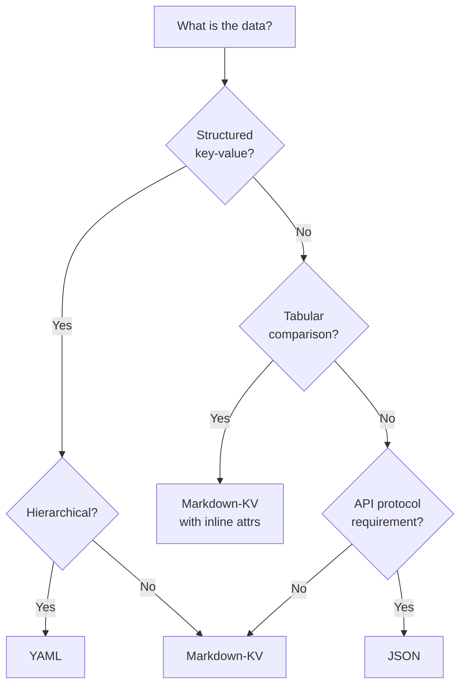

# Format Research Data

> Markdown-KV achieves 60.7% accuracy — 9 points above tables, 16 points above CSV.

Source: ImprovingAgents study, "Which Table Format Do LLMs Understand Best?" (11 formats tested)

---

## Format Comparison

### Accuracy Rankings

- **Markdown-KV** — 60.7% (best overall, default choice)
- **INI** — 55.7% (strong accuracy, low token overhead)
- **YAML** — 54.7% (good for hierarchical data)
- **JSON** — 52.3% (high accuracy but expensive syntax)
- **Natural Language** — 49.6% (surprisingly competitive)
- **Markdown-Table** — 51.9% (pipes and alignment waste tokens)
- **HTML** — 50.7% (tag overhead, no accuracy benefit)
- **CSV** — 44.3% (worst performer despite lowest tokens)

### Token Cost (relative, for equivalent data)

- **CSV** — lowest (minimal syntax)
- **INI** — low (key=value, section headers)
- **Markdown-KV** — low (bold key + colon + value)
- **YAML** — moderate (indentation-based)
- **Markdown-Table** — moderate (pipes, separators, alignment)
- **JSON** — high (braces, brackets, quotes, commas)
- **HTML** — highest (open/close tags, attributes)

### Accuracy-per-Token Efficiency

Best ROI (high accuracy, low tokens):

1. **Markdown-KV** — best accuracy, low tokens
2. **INI** — strong accuracy, lowest tokens
3. **YAML** — good accuracy, moderate tokens

Worst ROI:

- **JSON** — moderate accuracy, high tokens
- **HTML** — low accuracy, highest tokens
- **CSV** — worst accuracy despite lowest tokens

---

## Decision Tree



---

## Markdown-KV Deep Dive

### Why It Wins

- **Familiar syntax** — Markdown bullets overrepresented in training data; BPE tokenizers optimize for this pattern
- **Low overhead** — only `- **`, `**:`, and value text; no separators, alignment, or closing syntax
- **Key-value clarity** — bold keys provide visual and semantic anchoring
- **Flexible nesting** — indent for hierarchy without structural syntax changes

### Patterns

**Simple key-value:**
```markdown
- **Name**: requirements-analyst
- **Model**: opus
- **Role**: Extract requirements from Jira/Confluence/Figma
- **Dispatch**: Phase 1, max 40 requirements
```

**Multi-value field:**
```markdown
- **Sources**: Jira (tickets), Confluence (pages), Figma (designs), local files
- **Outputs**: requirements.md, coverage-matrix.md, handoff JSON
```

**Nested data:**
```markdown
- **Handoff**
  - **artifacts**: file paths written
  - **gaps**: skipped items with reasons
  - **status**: complete | partial
```

**Status tracking:**
```markdown
- **S1 Manual** — complete (Phase 1+2)
- **S2 Convert** — in-progress (Phase 2)
- **S4 Validate** — pending (Phase 3)
```

**Multi-attribute items:**
```markdown
- **requirements-analyst** — opus, Phase 1, extracts reqs, ~15K initial load
- **manual-test-writer** — sonnet, Phase 2, generates TCs, ~16K initial load
- **automation-engineer** — opus, Phase 2, writes E2E specs, ~16.5K initial load
```

---

## JSON Pitfalls

### Token Overhead

```json
{
  "name": "requirements-analyst",
  "model": "opus",
  "role": "Extract requirements",
  "dispatch": "Phase 1"
}
```
**Token cost:** ~35 tokens (braces, quotes, colons, commas)

```markdown
- **Name**: requirements-analyst
- **Model**: opus
- **Role**: Extract requirements
- **Dispatch**: Phase 1
```
**Token cost:** ~25 tokens (30% cheaper for same information)

### When JSON Is Required

- Tool call parameters (Claude structured outputs)
- API request/response bodies
- Config files consumed by code (package.json, biome.json)
- Serialization targets (handoff state files in `.sparq/state/`)

### When JSON Should Be Avoided

- Prompt context (use Markdown-KV)
- Agent/skill instruction files
- Human-readable documentation
- Inline data within markdown documents

---

## Migration Examples

### Table to Markdown-KV

**Before (table):**
```
| Agent              | Model  | Phase |
|--------------------|--------|-------|
| requirements-analyst | opus  | 1     |
| manual-test-writer   | sonnet | 2   |
| automation-engineer  | opus  | 2     |
```

**After (Markdown-KV):**
```markdown
- **requirements-analyst** — opus, Phase 1
- **manual-test-writer** — sonnet, Phase 2
- **automation-engineer** — opus, Phase 2
```

**Savings:** ~20% fewer tokens + 9% better LLM comprehension

### JSON Config to YAML

**Before:**
```json
{
  "project": {
    "framework": "playwright",
    "language": "typescript",
    "componentFileExtensions": [".vue", ".tsx"]
  }
}
```

**After:**
```yaml
project:
  framework: playwright
  language: typescript
  componentFileExtensions: [.vue, .tsx]
```

**Savings:** ~25% fewer tokens (no braces, quotes, commas)
