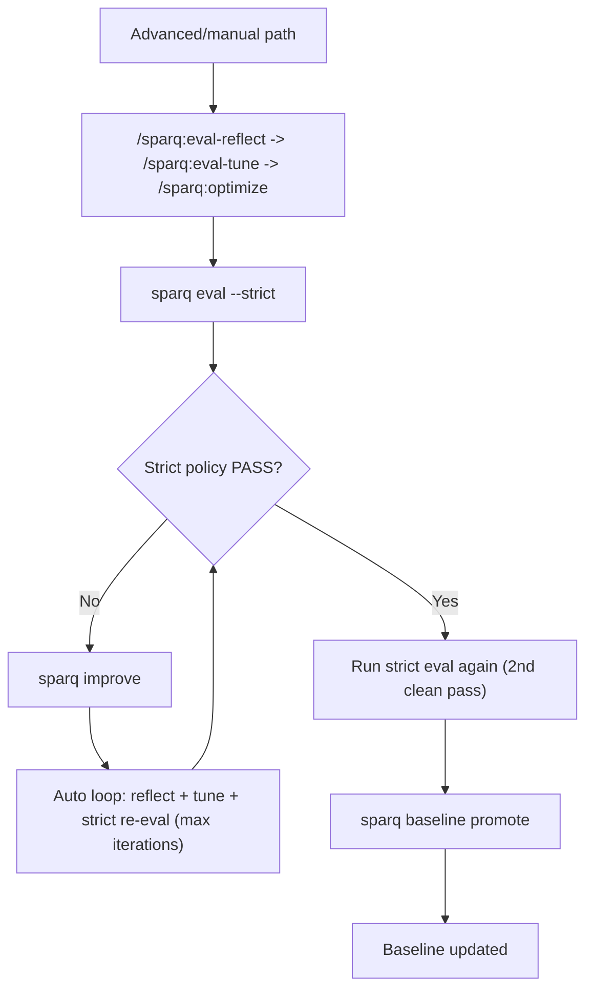
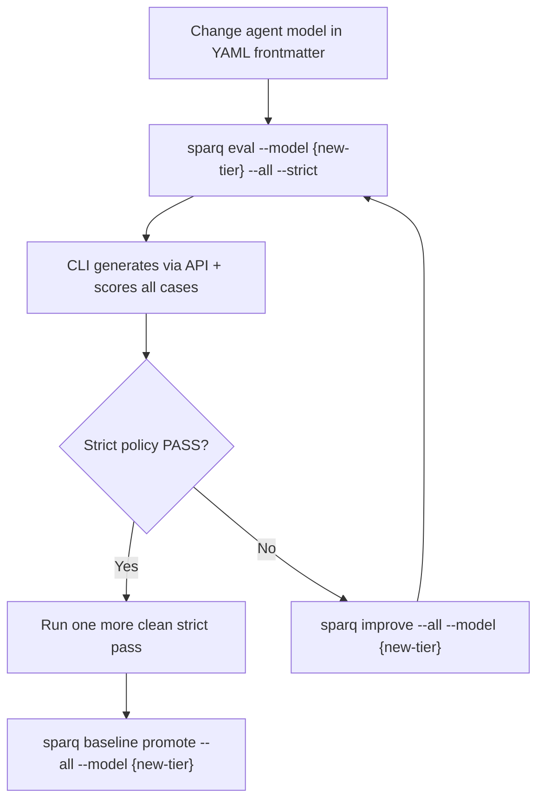

# Eval Workflow Reference

Eval-driven self-improvement loop for agent prompts. Referenced by: orchestrator, eval skills (`/sparq:eval`, `/sparq:improve`, `/sparq:baseline-promote`, `/sparq:eval-reflect`, `/sparq:eval-tune`), CLI eval command.
Default reliability-first flow is now:
1) `sparq eval <case|--all> --strict`
2) `sparq improve <case|--all>`
Baseline promotion is explicit: `sparq baseline promote <case|--all>` after policy eligibility.
Service/legacy primitives are non-default and hidden from default help (`sparq help advanced` to view).

## Prompt Development Flow



## Model Migration Flow

When an agent's model changes (e.g., `model: opus` → `model: sonnet` in YAML frontmatter, or Anthropic updates a model version), use this flow instead of manual prompt editing.



### Model Tier Guidance

Agent models map to capability tiers that affect prompt compliance:

- **Opus** (orchestrator, requirements-analyst, automation-engineer): strongest reasoning, follows implicit constraints, handles long chains. Standard PE priority ordering works well
- **Sonnet** (manual-test-writer, test-validator): strong structured generation, may miss implicit rules. Benefits from explicit constraints (PE-2), measurable criteria (PE-7), constants extraction (PE-4)
- **Haiku** (cost-optimized alternative): follows explicit instructions well, struggles with nuanced reasoning. Requires concrete examples (PE-3), negative constraints (PE-2), and extracted constants (PE-4). Expect 10-20% score drop from sonnet-level prompts without tuning

### Model Migration Checklist

1. Update `model:` in agent YAML frontmatter
2. Run CLI eval with `--model {new-tier}` to test all affected cases (costs API tokens)
3. If strict policy fails: run `sparq improve --all --model {new-tier}`
4. Re-eval until two consecutive clean strict passes, then `sparq baseline promote --all --model {new-tier}`
5. Commit updated agent files + new baselines together

### Model Tier Optimization

Optimize agent prompts for cheaper model tiers via `/sparq:tune` skill or `sparq tune` CLI command. Two layers:

- **Layer 1 (deterministic, CLI)**: Pre-authored prompt enhancements applied automatically — explicit constraints (PE-2), concrete examples (PE-3), constants extraction (PE-4), measurable criteria (PE-7). Runs locally, no API cost.
- **Layer 2 (AI-generated, skill)**: `/sparq:tune` analyzes eval results for the target tier and generates guidance — additional few-shot examples, negative constraints, simplified reasoning chains. Requires a generation-capable model.

Workflow: set `preferences.modelTier` in `sparq.config.json` → run `sparq eval --all --strict` → if failures, run `sparq tune --tier <target>` → re-eval until passing → `sparq baseline promote --all`.

### Skill vs CLI for Model Testing

- **Skills (primary path)**: `/sparq:eval` + `/sparq:improve` + `/sparq:baseline-promote` is the default UX. `eval` can run in mock mode, but `improve` may return `BLOCKED` unless a generation-capable model is resolved.
- For reliable tuning loop, prefer: `/sparq:eval ... --strict --model haiku` before `/sparq:improve`.
- **CLI** (`sparq eval --model haiku`): generates via Anthropic API with the specified model. Costs tokens. Use for cross-model testing after model changes
- For model migration, always use the CLI with `--model` to test the actual target model

## Scenario Pipelines

Canonical mapping from scenario to pipeline agents (also in `SCENARIO_PIPELINES` in `eval.mjs`):
- classification → orchestrator
- S1 → requirements-analyst, manual-test-writer
- S2 → automation-engineer
- S3 → requirements-analyst, automation-engineer
- S4 → test-validator
- S5 → requirements-analyst, test-validator
- S6 → automation-engineer (regression mode)
- S1+S2 → requirements-analyst, manual-test-writer, automation-engineer

## Commands

### Claude Code Skills (free via subscription)

- `/sparq:eval <case> [flags]` -- run evals via Claude Code (wraps CLI via Bash)
- `/sparq:improve <case|--all>` -- run bounded improve loop with strict re-eval
- `/sparq:baseline-promote <case|--all>` -- explicit baseline promotion after policy checks
- `/sparq:eval-reflect [service]` -- analyze latest saved results, map findings to agent sections, suggest fixes. Reports validated via `parseReflection()` for structural compliance
- `/sparq:eval-tune [reflection-file] [--latest] [--finding "text" --agent name] [service]` -- apply prompt engineering fixes from eval findings to agent files, present diffs for approval
- `/sparq:optimize <target> [service]` -- compress prompts for token efficiency after tuning (T1–T12 techniques)

### CLI Flags (local, always free)

- `sparq eval <case|--all> --strict` -- strict policy evaluation (default mode)
- `sparq eval <case|--all> --allow-skips` -- exploratory mode when skips are expected
- `sparq improve <case|--all>` -- bounded improve loop with clear terminal status
- Improve machine-readable lines:
  - `[sparq] IMPROVE_STATUS=<IMPROVED_AND_PASSING|PARTIAL_IMPROVEMENT|NO_IMPROVEMENT|BLOCKED>`
  - `[sparq] IMPROVE_ITERATIONS=<n>`
  - `[sparq] IMPROVE_TUNED_FILES=<n>`
  - `[sparq] NEXT_ACTION=<command>`
- `sparq baseline promote <case|--all>` -- promote baseline after 2 clean strict passes
- `sparq eval --audit` -- standalone prompt quality check (line counts, required sections)
- `sparq eval --trends` -- score history from saved runs
- `sparq eval <case> --project <dir>` -- resolve output paths relative to a custom project root (default: cwd)

### CLI Examples

```
sparq eval s2-manual-to-e2e                    # Score existing outputs (mock mode)
sparq eval --model haiku s2-manual-to-e2e      # Generate via API + score
sparq eval --model haiku --yes --all --strict  # Batch all cases via API (strict)
sparq improve s2-manual-to-e2e                 # Auto improve a failing case
sparq baseline promote s2-manual-to-e2e        # Promote after policy eligibility
sparq eval --audit                             # Check all agent prompts
sparq eval --trends                            # Score history
sparq eval s2-manual-to-e2e --project /tmp/out # Resolve outputs to custom dir
```

## Result JSON Schema

<result_schema>

```json
{
  "version": "3.0",
  "timestamp": "2026-02-12T10:30:00Z",
  "model": "mock",
  "strict": true,
  "runStatus": "FAIL",
  "policy": {
    "strict": true,
    "allowSkips": false,
    "runStatus": "FAIL",
    "requiredRubricsSkipped": 1
  },
  "skipReasons": ["model-required"],
  "requiredRubricsSkipped": 1,
  "passThreshold": 75,
  "improve": {
    "iteration": 1,
    "maxIterations": 3,
    "sourceRunFile": "20260213-120000.000-haiku.json",
    "reflectionFile": "20260213-120500.md",
    "appliedFixIds": ["fix-1"],
    "tunedFiles": ["claude/agents/sparq-automation-engineer.md"],
    "scoreDeltaByCase": [{ "caseName": "S2: Manual to E2E", "delta": 8 }]
  },
  "stats": {
    "apiCalls": 0,
    "inputTokens": 0,
    "outputTokens": 0,
    "durationMs": 1234,
    "estimatedCost": 0
  },
  "cases": [
    {
      "caseName": "S2: Manual to E2E",
      "scenario": "S2",
      "score": 18,
      "maxScore": 24,
      "percentage": 75,
      "status": "evaluated",
      "rubricResults": [
        {
          "rubric": "format-compliance",
          "score": 5,
          "maxScore": 6,
          "weight": 1,
          "findings": []
        }
      ],
      "pipeline": ["automation-engineer"]
    }
  ],
  "summary": {
    "totalScore": 18,
    "totalMaxScore": 24,
    "percentage": 75,
    "evaluated": 1,
    "passed": 1,
    "failed": 0
  }
}
```

</result_schema>

## Data Directories

- `test/evals/data/runs/` -- auto-saved eval results (one JSON per run, millisecond-precision timestamps)
- `test/evals/data/baselines/{model}/` -- per-case baseline files (one JSON per case per model, committed)
- `test/evals/data/reflections/` -- reflection analysis reports (markdown)

## Concurrency Safety

- **Run filenames** use millisecond timestamps + branch name (`YYYYMMDD-HHMMSS.mmm-{branch}-{model}.json`) — branch is omitted for main/master
- **Atomic writes** use a write-to-`.tmp`-then-rename pattern to prevent partial reads or corrupted files
- **Test isolation**: unit tests use `createTempDir()` with the `dataDir` option -- they never touch production data directories
- **`dataDir` option**: persistence functions (`saveResults`, `compareToBaseline`, `showTrends`, `loadLatestResults`) accept `options.dataDir` to redirect I/O to an alternate directory

## Artifact Persistence

- In mock mode, scoring reads artifacts from disk (project directory)
- In API mode, generated artifacts are written to disk before scoring (GAP 2.4 fix), enabling re-scoring in mock mode without re-generation
- Artifact paths match expected output paths from eval case YAML

## Parallel Limitations

19/27 eval cases share `.sparq/handoff.json` as an output path, and many also share `e2e/pages/LoginPage.ts` and `e2e/specs/login/login.spec.ts`. Running multiple cases in parallel causes agents to overwrite each other's artifacts before scoring, producing unreliable results. Use `sparq eval --all --strict` (sequential) to run cases one at a time.

## Baseline Comparison

- Baselines are per-case: `baselines/{model}/{case-name}.json` (v3.0 storage)
- Promotion is explicit (`sparq baseline promote`) and denied unless streak policy is satisfied:
  - `cleanStrictPassStreak >= 2`
  - optimize gate is clear
- Single-case promotion writes only the selected case baseline — no cross-case data loss
- `--all` promotion writes all eligible case baselines to `baselines/{model}/`
- Auto-compare triggers whenever a baseline exists for the current model and case
- Delta shown per-case; regressions highlighted in red, improvements in green
- **Delta direction**: overall comparison reports `improving` (>2%), `stable` (±2%), or `declining` (<-2%)
- **Agent checksums**: baselines store MD5 hashes of agent files — stale baselines (agents changed since baseline) trigger a warning
- Legacy v1 fallback: if no per-case files exist, reads `baselines/{model}.json` (single-file format)

## Reflection Mapping

<reflection_rules>

Findings from rubrics map to agent prompt sections:

- `convention_violation` -- `<constants>` or `<rules>` section
- `missing_pattern` -- `<done_criteria>` (add check) or step instructions
- `structural_error` -- workflow steps or `<handoff>` format
- `id_format` -- `<constants>` naming rules

</reflection_rules>

## Convergence Control

The self-improvement loop tracks health across iterations:

- **Oscillation**: If a case's score alternates up-down-up across 3 consecutive runs, eval-reflect flags it as oscillating — same fix may be applied and reverted
- **Stagnation**: If a case stays below 75% for 3+ runs with < 2% score change, eval-reflect flags it as stagnant — rubric may need substance changes
- **Iteration limit**: If 5+ runs since last baseline show no improvement, eval-reflect warns to consider updating rubrics or accepting current quality
- **Tune-protected content**: Rules added by `/sparq:eval-tune` (rubric-aligned fixes) are exempt from `/sparq:optimize` dedup (T4/T8/T9) to prevent oscillation
- **Mandatory re-eval**: After `/sparq:optimize` modifies agents, re-evaluate before committing
- **Model migration re-baseline**: After changing an agent's `model:` field, establish a new baseline with `sparq baseline promote --all --model {tier}` after two clean strict passes — previous baselines are invalid for the new model

### Eval State Module

`bin/lib/commands/eval-state.mjs` provides code-enforced safety functions:
- `createCheckpoint()` / `restoreCheckpoint()`: git stash rollback for agent file modifications
- `validateAgentFiles(names)`: check agent files exist before tune (returns valid/missing/warnings)
- `saveTuneRecord()` / `loadTuneHistory()`: fix traceability — records which fixes were applied
- `getProtectedSections()`: maps agents to sections modified by tune — exempt from optimize dedup
- `checkOptimizeGate()` / `setOptimizeMarker()` / `clearOptimizeMarker()`: enforce re-eval after optimize

## Rubric Categories & Weighting

Substance rubrics count **2×**, behavioral **1.5×**, structural **1×** in final scoring.

- **Substance rubrics (2×)**: assertion-detection (GAP 1.1), requirement-coverage (GAP 1.3), executability-check (GAP 1.2), coverage-completeness, playwright-syntax
- **Structural rubrics (1×)**: format-compliance, naming-conventions, template-compliance, handoff-compliance, parallel-merge, resume-state-compliance, regression-compliance
- **Behavioral rubrics (1.5×)**: error-handling-compliance, progress-signal-compliance
- **Model-based graders**: test-quality-grader, code-quality-grader, error-handling-grader (require `--model` API mode)
- In API mode (`--model`), model-based graders execute via the API and contribute to scoring. In mock mode, they are skipped (no API available)

## Pass Threshold

- 75% is PASS, below is FAIL
- Strict policy failures suggest `sparq improve <case|--all>` as the next action
- Track delta direction (improving/stable/declining), not just pass/fail
