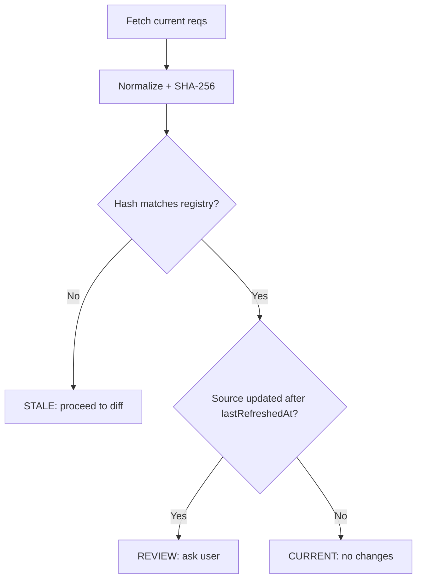

# Refresh Patterns Reference

Patterns for S5 (Refresh): syncing existing tests against updated requirements.

## Test Registry

Source of truth for test-to-requirement traceability. Located at `.sparq/tracking/test-registry.json`.

<registry_rules>
- Written immediately by each code-writing agent after file creation/modification (not deferred to Phase 3)
- Verified by orchestrator Phase 3 after S5 completes
- Read by S5 Phase 1.5 for staleness detection and traceability
- Read by S4 for coverage gap detection (optional)
- Never edited manually -- always machine-maintained
- One entry per test file (not per test case)
- If entry already exists for a test file, update it (merge testIds, update timestamps)
</registry_rules>

## Staleness Detection Algorithm

<staleness_detection>
S5 Phase 1.5 determines whether tests are stale using a two-signal approach:

**Signal 1: Requirements Hash (primary)**: Fetch current requirements, normalize (lowercase, strip whitespace, sort acceptance criteria alphabetically), compute SHA-256, compare against `requirementsHash` in registry. Hash differs = stale.

**Signal 2: Timestamp Comparison (secondary)**: Compare source `updated`/`lastModified` against registry `lastRefreshedAt`. Source updated after last refresh = flag for review even if hash matches.

**Combined decision**: Hash differs = always refresh. Hash matches + timestamp stale = ask user. Hash matches + timestamp current = up to date.
</staleness_detection>

## Traceability Lookup

<traceability_lookup>
When S5 needs to find which tests cover which requirements, use this fallback chain:

1. **Test Registry** (primary): Read `.sparq/tracking/test-registry.json` for `testFile → requirements[]` mapping
2. **Coverage Matrix** (fallback 1): Read `.sparq/coverage/coverage-matrix.md` for `requirementId → testCaseIds[]` mapping
3. **Test Title Matching** (fallback 2): Parse spec files for TC IDs in test titles (`TC-{feature}-{ABBR}-{NNN}`), map to requirements via naming convention
4. **No traceability found** (fallback 3): Treat all current requirements as NEW -- generate full diff against empty baseline

After first S5 refresh, the test gets registered in the registry for future use.
</traceability_lookup>

## Reverse Lookup: Ticket → Test Files

<reverse_lookup>
When user runs `/sparq:sync EP-14` (ticket only, no file path):

1. Search registry entries where `sourceTicket === "EP-14"`
2. If found → use those test files as refresh targets
3. If not found → grep spec files for `EP-14` in comments or describe blocks
4. If still not found → search `.sparq/requirements/REQ-*.md` for `EP-14` references, then find tests linked to those REQ IDs via registry
5. If nothing found → ask user to specify test file path
</reverse_lookup>

## Diff Categories and Actions

<diff_categories>
After fetching current requirements and parsing existing test coverage, classify each requirement:

**NEW** -- requirement exists in current source but not covered by any test
- Action: Generate new test blocks
- TC ID: Continue from highest existing `TC-{feature}-{ABBR}-{NNN}` in that category
- Insert position: After last test in relevant `test.describe` block

**CHANGED** -- requirement ID exists in both source and tests, but content differs
- Severity assessment:
  - `high`: Expected behavior/outcome changed (different assertion logic needed)
  - `medium`: Acceptance criteria added or removed (test steps need update)
  - `low`: Wording/label change only (no functional impact)
- Actions by severity:
  - `high` → Mark existing test with `// [REFRESH] REVIEW: {description}`. Generate suggested replacement test alongside marked with `// [REFRESH] SUGGESTED`. User reviews via `git diff`.
  - `medium` → Update assertions/steps inline. Mark with `// [REFRESH] UPDATED: {what changed}`
  - `low` → Add comment only: `// [REFRESH] NOTE: Requirement text updated, verify test still valid`

**REMOVED** -- requirement referenced by tests but no longer exists in current source
- Action: Mark test with `// [REFRESH] DEPRECATED: Requirement {REQ-ID} no longer exists in source`
- When `refresh.preserveDeprecated` is `true` (default): Keep test, add deprecation comment
- When `refresh.preserveDeprecated` is `false`: Remove test block, update barrel exports

**UNCHANGED** -- requirement exists in both, content matches
- Action: Skip, no changes needed
- Include in diff report for completeness (IDs only)
</diff_categories>

## TC ID Continuation Rules

<tc_id_rules>
When generating new tests during refresh:

1. Scan existing spec file for all TC IDs matching `TC-{feature}-{ABBR}-{NNN}`
2. Group by category abbreviation (HP, VE, SEC, EC, A11Y)
3. For each new test, assign next sequential number in its category
4. Example: existing HP tests are TC-login-HP-001 through HP-003 → new HP test gets TC-login-HP-004
5. Never reuse IDs of deprecated tests (even if removed)
6. If no tests exist in a category, start at 001
7. TC IDs are scoped per feature prefix -- no cross-file collision possible when feature names differ
</tc_id_rules>

## Multi-File Refresh Strategy

<multi_file_refresh>
When refreshing a directory (e.g., `/sparq:sync e2e/specs/auth/`):

1. Discover all spec files in directory
2. For each file, look up registry entry to find source ticket/requirements
3. Group files by source ticket (files from same ticket refresh together)
4. Process groups sequentially (shared page objects may need extending across files)
5. Within a group, if >10 files, use parallel batches (Pattern 2 from `parallel-execution.md`)
6. Deduplicate page object extensions across spec files in same group
7. Single coverage matrix update at the end (not per-file)
</multi_file_refresh>

## Registry Update After Refresh

<registry_update>
Registry updates happen immediately after file creation/modification (not deferred to a later phase). After S5 Phase 2 completes and user approves changes:

1. Update existing registry entry for each refreshed file:
   - Append new TC IDs to `testIds[]`
   - Update `requirements[]` to match current requirement set
   - Set `lastRefreshedAt` to current timestamp
   - Set `generatedBy` to `"S5"`
   - Update `requirementsHash` to current hash
2. If test file had no registry entry (first refresh), create new entry
3. Set registry `lastUpdated` to current timestamp
4. Write updated registry to `.sparq/tracking/test-registry.json`
</registry_update>
