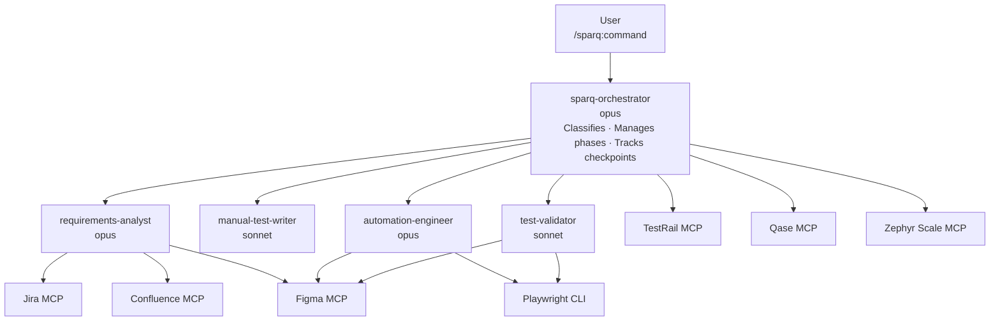

# SparQ Architecture

## System Overview



Data flows from user commands through the orchestrator, which dispatches work to specialized sub-agents. Each sub-agent connects to external services through MCP servers.

## Agent Hierarchy

| Agent | Role | Model | When Used |
|-------|------|-------|-----------|
| **sparq-orchestrator** | Classifies requests, coordinates phases, manages checkpoints | opus | Every request -- entry point |
| **sparq-requirements-analyst** | Gathers from Jira, Confluence, Figma, local files | opus | Phase 1 of Scenarios 1, 3, and 5 |
| **sparq-manual-test-writer** | Generates structured manual test cases (MD + XML) | sonnet | Phase 2 of Scenarios 1 and 5 (manual); support in 2 and 3 |
| **sparq-automation-engineer** | Generates E2E test code (Playwright or Cypress) with POM pattern; handles bug tickets as inline regression tests | opus | Phase 2 of Scenarios 2, 3, 5 (E2E); support in 4 |
| **sparq-test-validator** | Validates tests against current requirements and UI | sonnet | Phase 1 of Scenarios 4 and 5; Phase 2 of Scenario 4; refactor mode |

## MCP Integration Map

| MCP Server | Type | req-analyst | manual-writer | auto-engineer | test-validator | orchestrator |
|------------|------|:---:|:---:|:---:|:---:|:---:|
| **Atlassian (Jira)** | HTTP | X | -- | -- | -- | -- |
| **Atlassian (Confluence)** | HTTP | X | -- | -- | -- | -- |
| **Figma** | HTTP | X | -- | X | X | -- |
| **Playwright** | CLI | -- | -- | X | X | -- |
| **TestRail** | stdio | -- | -- | -- | -- | X |
| **Qase** | stdio | -- | -- | -- | -- | X |
| **Zephyr Scale** | stdio | -- | -- | -- | -- | X |

> **Note:** manual-test-writer has no direct MCP access — it consumes the structured requirements document produced by requirements-analyst. For bug ticket inputs, automation-engineer receives bug ticket data via orchestrator handoff and appends regression tests inline to the relevant feature spec. test-validator reads local requirements docs and compares against Figma designs and Playwright CLI output for coverage checks but does not query Jira directly.

**Connection details:**

- **Atlassian** -- `https://mcp.atlassian.com/v1/mcp` (HTTP, OAuth)
- **Figma** -- `https://mcp.figma.com/mcp` (HTTP, OAuth)
- **Playwright** -- Playwright CLI (`npx playwright`, local dev dependency)
- **TestRail** -- `npx -y @bun913/mcp-testrail` (stdio, env vars)
- **Qase** -- `npx -y @qase/mcp-server` (stdio, env vars)
- **Zephyr Scale** -- `npx -y @anthropic/zephyr-mcp` (stdio, env vars)

## Data Flow

```mermaid
flowchart TD
  subgraph Sources
    Jira[Jira ticket] ~~~ Conf[Confluence] ~~~ Figma[Figma design] ~~~ Local[Local files] ~~~ Text[User text]
  end

  Discovery[Project Discovery<br/>e2e/ scan, config detection] --> TC

  Sources --> REQ[.sparq/requirements/<br/>REQ-feature.md]
  REQ --> TC[.sparq/test-cases/<br/>TC-feature-manual.md<br/>TC-feature-manual.xml]
  REQ --> Auto[e2e/ project directory<br/>pages · steps · specs · fixtures]
  REQ --> Cov[.sparq/coverage/<br/>coverage-matrix.md]
  REQ --> Refresh[.sparq/refresh/<br/>diff reports]
  Sources -->|S3 bug ticket| Reg[e2e/specs/{feature}.spec.ts<br/>REG-ticket inline append]
  Auto --> Registry[.sparq/tracking/<br/>test-registry.json]
  Registry -->|S5 Refresh| Refresh
  Refresh -->|approved changes| Auto
  TC --> E2E[e2e/specs/ approved]
  TC --> TR[TMS exported<br/>TestRail · Qase · Local]
```

**Key paths:**

- **Requirements** -- `.sparq/requirements/REQ-{feature}.md`
- **Manual test cases** -- `.sparq/test-cases/TC-{feature}-manual.md` and `.xml`
- **Generated E2E code** -- project `e2e/` directory (per `e2e.structure.*` config; Playwright or Cypress)
- **Coverage matrices** -- `.sparq/coverage/coverage-matrix.md`
- **Validation reports** -- `.sparq/validation/validation-report.md`
- **Refresh diffs** -- `.sparq/refresh/REFRESH-{feature}-diff.md`
- **Regression tests** -- inline in relevant feature spec with `REG-{ticket}-{NNN}` in test title
- **Test registry** -- `.sparq/tracking/test-registry.json`
- **Run history** -- `.sparq/tracking/run-history.json` (workflow outcomes + flow metrics)
- **Last run summary** -- `.sparq/last-run.md`
- **Execution plans** -- `.sparq/plans/execution-plan.md`
- **Workflow state** -- `.sparq/state/` (current-task.json, journal.json, parallel.json, config-snapshot.json)

## Skill-to-Agent Mapping

| Skill | Primary Agent | Support Agent |
|-------|--------------|---------------|
| `/sparq:analyze` | requirements-analyst | -- |
| `/sparq:generate` | manual-test-writer + automation-engineer | requirements-analyst (if no REQ doc) |
| `/sparq:generate-manual` | manual-test-writer | requirements-analyst (if no REQ doc) |
| `/sparq:manual-to-e2e` | automation-engineer | manual-test-writer (gap analysis) |
| `/sparq:generate-e2e` | automation-engineer | requirements-analyst (Phase 1) |
| `/sparq:validate` | test-validator | automation-engineer (auto-fixes) |
| `/sparq:sync` | orchestrator (requirement sync) | requirements-analyst + test-validator + automation-engineer or manual-test-writer |
| `/sparq:export` | orchestrator (direct) | -- |
| `/sparq:resume` | orchestrator (resume dispatch) | -- |
| `/sparq:refactor` | test-validator (refactor mode) | orchestrator (dispatch) |
| `/sparq:publish-results` | orchestrator (direct) | -- |
| `/sparq:init` | orchestrator (direct) | -- |

## Configuration

`sparq.config.json` in the project root controls all behavior. During `init`, SparQ automatically detects your E2E structure (page objects, step classes, fixtures, components) and project settings (framework, component extensions, source root) from `package.json`, populating the `e2e` and `project` sections.

```json
{
  "version": "1.0.0",
  "project": {
    "testDir": "e2e",
    "sourceRoot": "src",
    "routeDiscoveryPattern": "**/router/**/*.ts",
    "componentFileExtensions": [".vue"]
  },
  "sources": {
    "jira": { "enabled": true, "projectKey": "EP" },
    "confluence": { "enabled": true, "spaceKey": "PROJ" },
    "figma": { "enabled": true },
    "local": { "enabled": true, "requirementsDir": "docs/specs" }
  },
  "e2e": {
    "detected": true,
    "framework": "playwright",
    "structure": { "pages": "e2e/pages", "components": "e2e/components", "steps": "e2e/steps", "fixtures": "e2e/fixtures", "specs": "e2e/specs" },
    "baseClass": "e2e/pages/abstract.page.ts",
    "fixtureIndex": "e2e/fixtures/index.ts"
  },
  "outputs": {
    "testCases": { "format": "both", "outputDir": ".sparq/test-cases" },
    "automation": { "framework": "playwright" },
    "tms": { "provider": "testrail", "testrail": { "projectId": 1, "suiteId": 1 }, "qase": { "projectCode": null }, "local": { "outputDir": ".sparq/exports", "format": "json" } },
    "jira": { "enabled": false, "createSubTask": false },
    "confluence": { "enabled": false, "spaceKey": null, "parentPageTitle": null }
  },
  "refresh": { "preserveDeprecated": true, "autoApplyLowSeverity": false },
  "preferences": {
    "interactiveMode": true,
    "locatorPriority": ["getByTestId", "getByRole", "getByLabel", "getByText"],
    "testMultiplier": 5,
    "maxClarifications": 2,
    "checkpointLevel": "full",
    "smokeVerify": "list",
    "modelTier": "premium"
  }
}
```

## Project Detection

During `init`, SparQ reads your `package.json` dependencies to auto-detect:

- **Framework** -- Vue, React, Angular, or Svelte (from `vue`, `react`, `@angular/core`, `svelte` dependencies)
- **UI library** -- PrimeVue, Vuetify, Quasar, Element Plus, Naive UI, Ant Design Vue, Headless UI (from corresponding packages)
- **Test runner** -- Playwright or Cypress (from corresponding dev dependencies)
- **Language** -- TypeScript or JavaScript (from `typescript` dev dependency)
- **Component file extensions** -- derived from detected framework (e.g., `[".vue"]`, `[".tsx", ".jsx"]`)
- **Source root** -- auto-detected (`src/`, `app/`, `lib/`)
- **Route discovery pattern** -- derived from detected router (e.g., `"**/router/**/*.ts"`)

Detection results are stored in the `project` section of `sparq.config.json` (for `sourceRoot`, `componentFileExtensions`, `routeDiscoveryPattern`) and used at runtime for selector strategies and code generation. If detection is incorrect, you can override values manually in the config file.

## Directory Structure

Metadata goes into `.sparq/` (gitignored by default). E2E test code is written directly to the project test directory per `e2e.structure.*` config.

```
.sparq/                        # Metadata only (gitignored)
├── last-run.md                # Latest run summary
├── requirements/              # REQ-{feature}.md
├── test-cases/                # TC-{feature}-manual.md + .xml
├── coverage/                  # coverage-matrix.md
├── validation/                # validation-report.md
├── refresh/                   # REFRESH-{feature}-diff.md, REQ-{feature}-previous.md
├── tracking/                  # test-registry.json, run-history.json
├── parallel/                  # Shared patches during parallel execution
├── plans/                     # execution-plan.md (temporary)
└── state/                     # Workflow state for resume (current-task, journal, parallel, config-snapshot)

e2e/                           # E2E code (direct-write, per e2e.structure.* config)
├── pages/                     # Page Object Models
├── steps/                     # Reusable step helpers
├── fixtures/                  # Test fixtures
├── components/                # Component objects
└── specs/                     # Playwright test specs (regression tests appended inline with REG- IDs)
```

## Glossary

- **P0 (Scenario Classification)**: Orchestrator classifies the user request into S1-S6
- **P0.5 (Project Discovery)**: Scan and summarize the target project's E2E infrastructure
- **P1 (Requirements Gathering)**: Fetch requirements from Jira/Confluence/Figma/local sources
- **P1.5 (Diff Analysis)**: S5 only -- compare current requirements against existing tests to categorize changes
- **P1-P2 (Bug Regression)**: S3 bug ticket sub-mode -- extract bug details from ticket, generate inline regression test appended to feature spec
- **P2 (Test Generation/Conversion/Validation)**: Core work phase -- generate tests, convert formats, or validate existing tests
- **P3 (Verification, Registry & Export)**: Smoke verify, present changes for review, update test registry, export to external systems
- **Checkpoint**: Explicit user approval gate between phases -- the orchestrator blocks until the user approves, rejects, or modifies the proposed plan
- **Handoff**: Structured JSON message passed between agents containing counts, artifacts, gaps, and instructions per `handoff-schema.md`
- **Sub-agent**: Any agent dispatched by the orchestrator (requirements-analyst, manual-test-writer, automation-engineer, test-validator)
- **Tier 1/2/3**: File isolation levels for parallel execution (1=exclusive direct-write, 2=staged shared patches, 3=read-only)
- **HP**: Happy Path -- core success scenarios
- **VE**: Validation & Error -- input validation, error handling
- **SEC**: Security -- authentication, authorization, injection
- **EC**: Edge Case -- unusual inputs, boundaries
- **A11Y**: Accessibility -- screen reader, keyboard, WCAG
- **Test Registry**: JSON file at `.sparq/tracking/test-registry.json` that tracks which test files cover which requirements. Maps `TC-*` IDs to `REQ-*` IDs with content hashes for change detection. Updated by S1/S2/S3/S5 (not S4). Used by S5 for diff analysis.
- **Run History**: JSON file at `.sparq/tracking/run-history.json` tracking completed runs (scenario, outputs, files changed). Includes optional `flowMetrics` such as `timeToFirstArtifactSec`, `clarificationTurns`, `fallbackCount`, `checkpointCount`, and `firstPassSuccess` for UX monitoring.

## Design Decisions

### Why Page Object Model + BDD

POM provides maintainable selector management -- when UI changes, only the page object needs updating. BDD-style descriptions (Given/When/Then) create shared vocabulary between manual QA and automated tests, making conversion straightforward.

### Why Checkpoint-Based Workflow

Each phase blocks until user approval. This prevents wasted compute on unwanted directions and builds trust by giving the user control at every stage: approving scope, reviewing test cases, confirming output.

### Why MCP for External Integrations

MCP provides standardized interfaces between AI coding assistant agents and external services:

- **No credentials in agent code** -- MCP servers manage their own auth
- **Graceful degradation** -- unavailable servers are skipped
- **Extensibility** -- new integrations only need an MCP server config
- **Community servers** -- leverages existing open-source implementations
