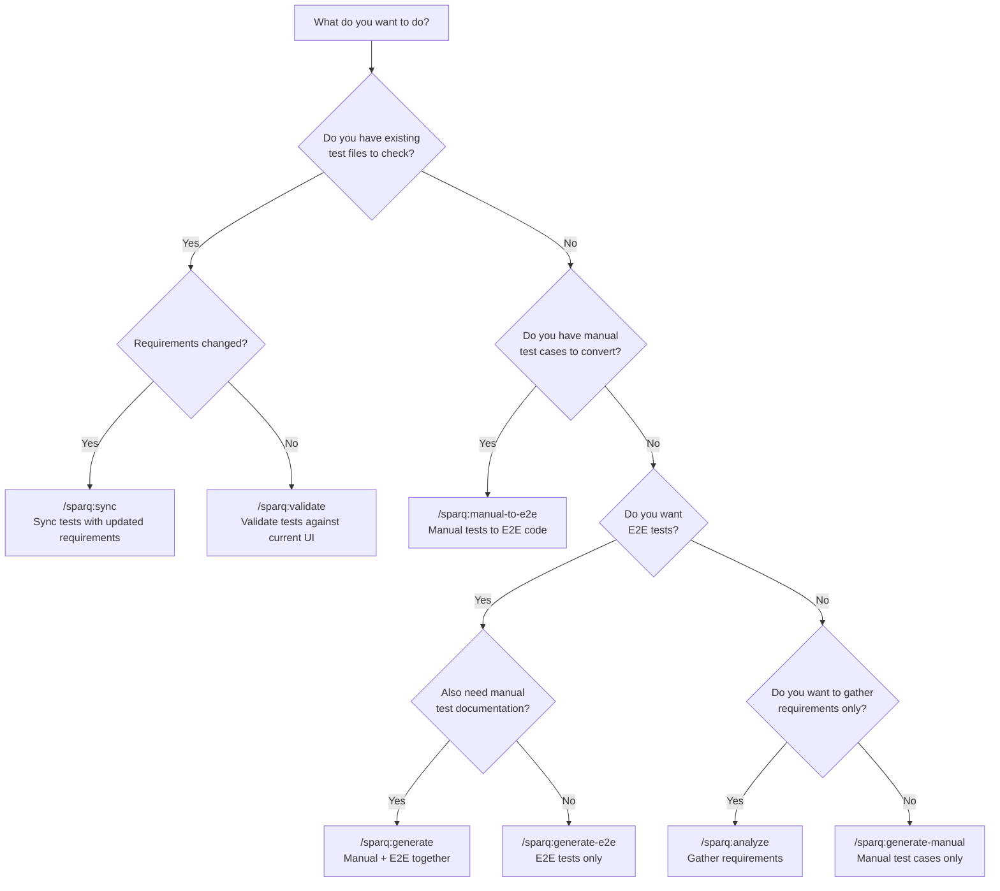

# SparQ Daily Usage Guide

Use `/sparq:start` when you are unsure which command to run; it routes to the best workflow with minimal clarifications.

Two-step mental model:
- `Generate` lane: `/sparq:generate-manual`, `/sparq:generate-e2e`, `/sparq:generate`, `/sparq:manual-to-e2e`
- `Maintain` lane: `/sparq:validate`, `/sparq:sync`, `/sparq:regression`, `/sparq:export`

## Which Command Do I Need?



**S4 vs S5 — which one do I need?**

| Situation | Use | Why |
|-----------|-----|-----|
| UI redesign shipped, tests may have broken selectors | `/sparq:validate` (S4) | Checks selectors and flows against current codebase |
| Jira ticket requirements were updated | `/sparq:sync` (S5) | Diffs old vs new requirements, updates test coverage |
| New Figma designs pushed, need to verify test accuracy | `/sparq:validate` (S4) | Compares assertions against current UI state |
| Acceptance criteria added to existing ticket | `/sparq:sync` (S5) | Detects NEW requirements and generates missing tests |
| Not sure what changed | `/sparq:validate` first | Quick scan; if it finds req gaps, chain to `/sparq:sync` |

**Quick decision guide:**

| I want to... | Use |
|--------------|-----|
| Let SparQ pick the right workflow for me | `/sparq:start` |
| Generate both manual tests AND E2E automation | `/sparq:generate EP-14` |
| Generate manual test cases only | `/sparq:generate-manual EP-14` |
| Convert existing manual tests to E2E code | `/sparq:manual-to-e2e path/to/tests.md` |
| Generate E2E tests from scratch (no manual) | `/sparq:generate-e2e EP-198` |
| Check if my tests match the latest UI | `/sparq:validate e2e/specs/auth/` |
| Sync existing tests with updated requirements | `/sparq:sync EP-14 e2e/specs/auth/login.spec.ts` |
| Gather requirements without generating tests | `/sparq:analyze EP-14` |
| Export test cases to TestRail, Qase, local folder, Jira, or Confluence | `/sparq:export login` |
| Resume an interrupted workflow | `/sparq:resume` |

## Quick Reference

- `/sparq:start` -- Default guided entry point and workflow router: `/sparq:start`
- `/sparq:analyze` -- Gather requirements from Jira/Figma/Confluence: `/sparq:analyze EP-14`
- `/sparq:generate` -- Create manual tests AND E2E tests together: `/sparq:generate EP-14`
- `/sparq:generate-manual` -- Create manual test cases only: `/sparq:generate-manual for the login feature`
- `/sparq:manual-to-e2e` -- Convert manual tests to E2E code: `/sparq:manual-to-e2e these test cases to automation`
- `/sparq:generate-e2e` -- Generate E2E tests from scratch (no manual): `/sparq:generate-e2e EP-198 User Creation`
- `/sparq:validate` -- Validate tests against current UI and codebase: `/sparq:validate e2e/specs/auth/`
- `/sparq:sync` -- Sync tests with updated requirements: `/sparq:sync EP-14 e2e/specs/auth/login.spec.ts`
- `/sparq:export` -- Export to TestRail, Qase, local folder, Jira, or Confluence: `/sparq:export login`
- `/sparq:resume` -- Resume an interrupted workflow: `/sparq:resume`
- `/sparq:regression` -- Generate regression test from bug ticket: `/sparq:regression BUG-42`
- `/sparq:refactor` -- Refactor selectors/patterns across tests: `/sparq:refactor --from "old" --to "new" e2e/`
- `/sparq:init` -- Bootstrap SparQ configuration: `/sparq:init`
- `/sparq:config` -- View or edit SparQ configuration: `/sparq:config`
- `/sparq:tune` -- Apply model tier guidance to agents: `/sparq:tune`
- `/sparq:playwright-best-practices` -- Playwright testing best practices reference
- `/sparq:cypress-best-practices` -- Cypress testing best practices reference

## Input Formats

| Input Type | Format | Example | Works With |
|------------|--------|---------|------------|
| Jira ticket | Project key + number | `EP-14`, `PROJ-456` | analyze, generate, generate-manual, generate-e2e, sync, regression |
| Figma URL | Full Figma design URL | `https://www.figma.com/design/abc123` | analyze, generate, generate-manual |
| Confluence URL | Full page URL | `https://team.atlassian.net/wiki/spaces/PROJ/pages/123` | analyze, generate, generate-manual |
| File path | Relative or absolute path | `e2e/specs/auth/`, `.sparq/test-cases/TC-login-manual.md` | manual-to-e2e, validate, sync |
| Free text | Plain description | `"login flow for admin users"` | generate-manual, generate-e2e |
| Multiple inputs | Space-separated | `EP-14 https://figma.com/design/abc` | analyze, generate |

## Common Workflows

### 1. "I need both manual tests AND E2E automation for this feature"

```
/sparq:generate EP-14
```

Gathers requirements, generates manual test cases (5 categories), then automatically converts automatable cases to E2E code (Playwright or Cypress per config). No need to run separate commands. You review manual tests and E2E code at separate checkpoints.

Output: `.sparq/test-cases/TC-{feature}-manual.md` and `.xml`, project `e2e/` directory — `specs/`, `pages/`, `steps/`, `fixtures/`

### 2. "I have a new Jira ticket and need manual tests only"

```
/sparq:generate-manual EP-14
```

Gathers requirements from the ticket (plus linked Confluence pages and Figma designs), proposes a test plan, generates test cases across happy path, validation, security, edge cases, and accessibility.

Output: `.sparq/test-cases/TC-{feature}-manual.md` and `.xml`, `.sparq/coverage/coverage-matrix.md`

### 3. "I have manual tests and want to automate them"

Paste test cases directly or reference a file:

```
/sparq:manual-to-e2e .sparq/test-cases/TC-login-manual.md
```

Parses manual steps, scans existing `e2e/` infrastructure for reusable page objects and helpers, enriches selectors from Figma, generates E2E specs. Manual-only tests (visual, subjective UX) are skipped with a note.

Output: project `e2e/` directory — `specs/`, `pages/`, `steps/` (per `e2e.structure.*` config)

### 4. "I need E2E tests for this feature (no manual docs)"

```
/sparq:generate-e2e EP-198
```

Combines requirements gathering and code generation. Fetches requirements, proposes automation strategy (automate vs. manual), generates E2E code after approval.

Output: project `e2e/` directory — `specs/`, `pages/`, `fixtures/` (per `e2e.structure.*` config)

### 5. "UI was updated, are my tests still valid?"

```
/sparq:validate e2e/specs/auth/
```

Compares selectors and assertions against current codebase and Figma designs. Reports broken selectors, stale flows, text mismatches, and coverage gaps. Choose to auto-fix, review one-by-one, or save report only.

Output: `.sparq/validation/validation-report.md`

### 6. "Requirements were updated, are my tests still current?"

```
/sparq:sync EP-14 e2e/specs/auth/login.spec.ts
```

Reads the test registry to find existing test-to-requirement mappings, fetches current requirements from the ticket, diffs against previous requirements using content hashing. Shows what's NEW, CHANGED, REMOVED, or UNCHANGED. After approval, generates new tests, updates changed tests, and marks deprecated tests.

Output: `.sparq/refresh/REFRESH-{feature}-diff.md`, updated specs, updated registry

### 7. "Export test cases to external tools"

```
/sparq:export login
/sparq:export testrail login
/sparq:export qase login
/sparq:export local login
/sparq:export jira EP-14
/sparq:export confluence login
```

Exports to TestRail, Qase, local folder, Jira, and/or Confluence via MCP. Without a target, exports to all enabled targets in `sparq.config.json`. If an MCP connection is unavailable, generates importable files with manual instructions.

### 8. "My session got interrupted mid-pipeline"

```
/sparq:resume
```

Detects the last execution plan and persisted handoffs, validates staleness (warns if >24h, recommends fresh start if >7d), and offers to resume from the last completed phase. If config changed since the interruption, you'll be warned. Choose Resume, Fresh Start, or View Previous.

> **Note:** SparQ adapts to your project automatically. Whether you use Vue, React, Angular, or Svelte, the commands and workflows below work the same way. Your framework, UI library, and test runner are detected from `package.json` during setup.

## Tips for QA Engineers

**Review before approving.** Checkpoints exist to catch issues early. Read through proposed test plans and generated test cases before approval -- the AI may miss domain-specific edge cases.

**Add context at checkpoints.** When paused for approval, provide additional info: "Also cover MFA-enabled users" or "Admin role should use API-seeded data, not UI signup." This steers generation without starting over.

**Git is your safety net.** Generated tests are written directly to your project's `e2e/` directory. Use `git diff` to review changes and `git checkout -- e2e/` to revert if needed.

**Keep config current.** When project structure changes (new test directory, different Jira project), update `sparq.config.json`.

**Combine inputs.** Most commands accept multiple sources:

```
/sparq:analyze EP-14 https://www.figma.com/design/abc123
/sparq:generate-manual EP-14 https://team.atlassian.net/wiki/spaces/PROJ/pages/456
```

**Chain workflows.** After manual tests, SparQ offers conversion. After automated tests, it offers validation. Let the chain run for a complete pipeline.

**Refresh detection.** If you add new page objects or components after initial setup, run `npx sparq-assistant update` to refresh E2E and project detection.

**Preview changes with `--dry-run`.** Run `npx sparq-assistant init --dry-run` or `npx sparq-assistant update --dry-run` to see what files would be created or overwritten without making changes.

**Clean up artifacts.** Run `npx sparq-assistant clean` to remove stale files from `.sparq/`. Filter by type (`--type=requirements`) or age (`--older-than=30` days). Use `--all` to include protected files like the test registry.

**Diagnose issues.** Run `npx sparq-assistant doctor` to verify your installation — checks agents, skills, config, MCP servers, and E2E setup. Add `--deep` for MCP credential and endpoint validation.

**Reduce checkpoint prompts.** Add `"checkpointLevel": "standard"` to `preferences` in `sparq.config.json` to collapse low-risk checkpoints. Use `"minimal"` to keep only the output review gate.

**Clean removal.** Run `npx sparq-assistant uninstall` to remove all SparQ files from the project.

## When MCP Servers Are Unavailable

| MCP Server | Fallback Behavior | Impact |
|------------|-------------------|--------|
| **Jira** | Prompts for manual requirement text input | Requirements gathering continues with user-provided data |
| **Confluence** | Skips Confluence pages, notes gap in requirements | May miss specification details; gap logged |
| **Figma** | Greps codebase for selectors and component names | Selectors derived from code instead of design tokens |
| **Playwright** | Smoke check uses `npx tsc --noEmit` instead | Type-checks generated code; cannot verify runtime behavior |
| **TestRail/Qase** | Generates importable files with manual instructions | Export artifacts created locally; user uploads manually |

All fallbacks are automatic — SparQ retries 3 times with exponential backoff before falling back. See [error-handling.md](claude/skills/sparq-shared/references/error-handling.md) for full retry/circuit-breaker details.

## Output Files

Metadata written to `.sparq/` (gitignored by default), E2E code written directly to the project test directory:

- `.sparq/requirements/` -- Structured requirement documents, one per feature. Created by `/sparq:analyze`, `/sparq:generate`, `/sparq:generate-manual`, `/sparq:generate-e2e`
- `.sparq/test-cases/` -- Manual test cases in markdown and TestRail XML. Created by `/sparq:generate`, `/sparq:generate-manual`
- Project `e2e/` directory -- Generated E2E code: `pages/`, `specs/`, `steps/`, `fixtures/` (written directly per `e2e.structure.*` config). Created by `/sparq:generate`, `/sparq:manual-to-e2e`, `/sparq:generate-e2e`
- `.sparq/coverage/` -- Coverage matrices mapping requirements to test cases. Created by `/sparq:generate`, `/sparq:generate-manual`
- `.sparq/validation/` -- Validation reports with findings and severity levels. Created by `/sparq:validate`
- `.sparq/refresh/` -- Diff reports, previous requirements snapshots. Created by `/sparq:sync`
- `.sparq/tracking/` -- Test registry (`test-registry.json`) tracking test-to-requirement traceability. Updated by `/sparq:generate`, `/sparq:generate-manual`, `/sparq:generate-e2e`, `/sparq:sync`
- `.sparq/plans/` -- Execution plan tracking (temporary, cleaned up after completion). Created by all scenarios

---

**Next**: Read [SCENARIOS.md](SCENARIOS.md) for detailed phase walkthroughs of each scenario.
