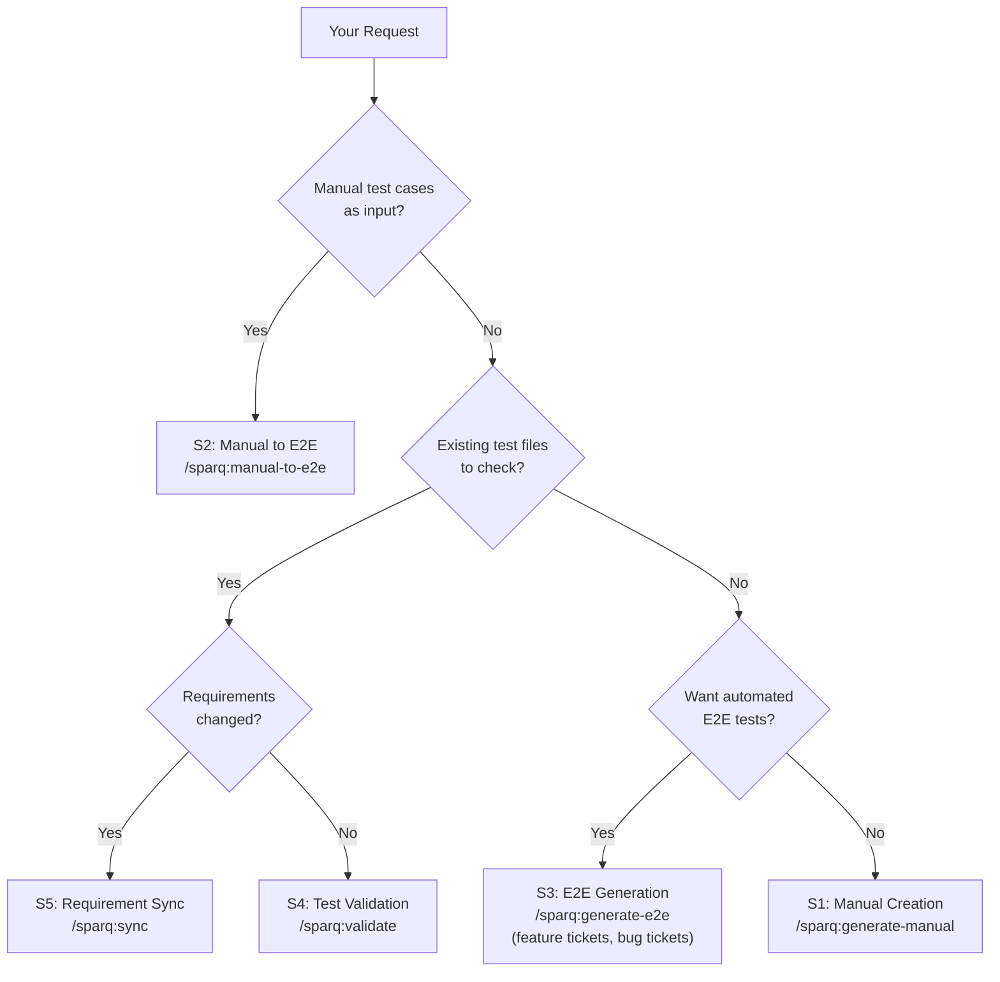
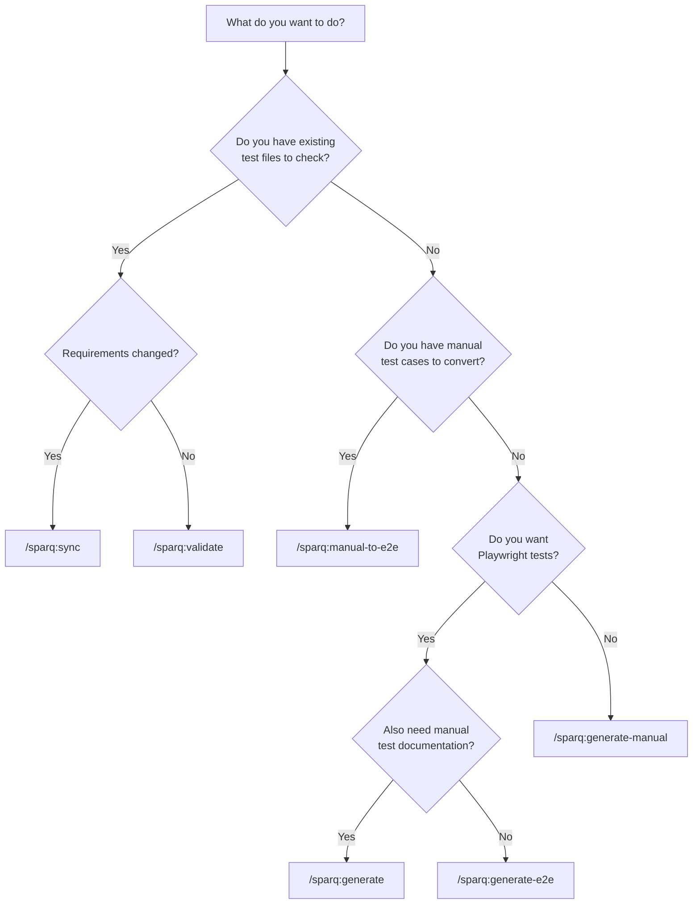

# Getting Started with SparQ

A beginner's guide to installing, configuring, and running your first QA test generation workflow with Playwright or Cypress.

## Table of Contents

- [What is SparQ?](#what-is-sparq)
- [Key Concepts](#key-concepts)
- [Prerequisites](#prerequisites)
- [Installation](#installation)
- [What Just Got Installed?](#what-just-got-installed)
- [Your First Workflow](#your-first-workflow)
- [Reviewing Generated Output](#reviewing-generated-output)
- [All Available Commands](#all-available-commands)
- [Setting Up MCP Integrations](#setting-up-mcp-integrations)
- [Common Recipes](#common-recipes)
- [CLI Management](#cli-management)
- [Troubleshooting](#troubleshooting)
- [Next Steps](#next-steps)

---

## What is SparQ?

SparQ is a QA testing toolkit that works inside your AI coding assistant — [Claude Code](https://docs.anthropic.com/en/docs/claude-code), [Cursor](https://cursor.com), or [Codex](https://openai.com/index/codex/). You describe what you want to test — by pointing to a Jira ticket, pasting requirements, or providing a Figma link — and SparQ generates structured manual test cases and end-to-end (E2E) test code (Playwright or Cypress) for you.

**What makes SparQ different:**

- It reads your existing codebase and matches your project's patterns (page objects, fixtures, naming conventions)
- It pulls requirements from multiple sources (Jira, Confluence, Figma, local docs) and cross-references them
- Every step requires your approval before proceeding -- you stay in control
- Generated code goes directly into your project's test directory, ready to run

**Who is this for?**

- **QA engineers** who want to accelerate test case creation
- **Developers** who need E2E test coverage for features they're building
- **Team leads** who want consistent test quality across the project

**By the end of this guide, you will have:**

1. Installed SparQ into your project
2. Understood what each piece does
3. Run your first test generation workflow
4. Learned how to review and use the output

---

## Key Concepts

Before diving in, here are the core ideas you'll encounter.

### AI Coding Assistant

SparQ works inside your AI coding assistant. It auto-detects every AI editor present in your project and installs extras for all of them simultaneously — no flag required.

- **[Claude Code](https://docs.anthropic.com/en/docs/claude-code)** — Anthropic's CLI coding assistant (always active). Agents and skills install to `.claude/`.
- **[Cursor](https://cursor.com)** — detected via `.cursor/` directory. SparQ installs MCP config to `.cursor/mcp.json` and rules to `.cursor/rules/sparq.mdc`.
- **[Codex](https://openai.com/index/codex/)** — detected via `.codex/` or `.agents/` directory. SparQ installs config to `.codex/config.toml` and symlinks skills to `.agents/skills/`.

All detected editors get the same agents, skills, and pipeline. You can use Claude Code, Cursor, and Codex on the same project at the same time.

### Agents

Agents are specialized AI workers, each trained for a specific task. SparQ has five agents:

| Agent | What It Does | Think of It As... |
|-------|-------------|-------------------|
| **Orchestrator** | Routes your request to the right agents, manages the workflow | Project manager |
| **Requirements Analyst** | Gathers info from Jira, Confluence, Figma, and local docs | Business analyst |
| **Manual Test Writer** | Creates structured manual test cases | QA writer |
| **Automation Engineer** | Generates E2E test code (Playwright or Cypress); handles bug tickets as inline regression tests | Test automation developer |
| **Test Validator** | Checks existing tests for staleness and drift; also handles bulk refactoring | QA reviewer |

You don't interact with agents directly -- the orchestrator assigns them work based on what you ask for.

### Skills (Slash Commands)

Skills are commands you type in your AI coding assistant to start a workflow. They look like `/sparq:something`. For example:

```
/sparq:start
```

This opens the guided router. You can also run direct commands like `/sparq:generate EP-14` when you already know the lane.

Here are the main skills:

| Skill | Purpose |
|-------|---------|
| `/sparq:start` | Default guided entry and intent router |
| `/sparq:generate` | Generate both manual tests and E2E code |
| `/sparq:generate-manual` | Generate manual test cases only |
| `/sparq:generate-e2e` | Generate E2E tests only (Playwright or Cypress) |
| `/sparq:manual-to-e2e` | Convert existing manual tests to E2E code |
| `/sparq:validate` | Check existing tests for broken selectors and drift |
| `/sparq:sync` | Update tests when requirements change |
| `/sparq:publish-results` | Publish test run results to TMS |
| `/sparq:export` | Push test cases to TestRail, Qase, or local folder |
| `/sparq:refactor` | Bulk rename selectors or patterns across tests |
| `/sparq:analyze` | Gather requirements without generating tests |
| `/sparq:resume` | Resume an interrupted workflow |
| `/sparq:config` | Review and update SparQ configuration |

Lane model used by `/sparq:start`:
- `Generate` lane: `/sparq:generate-manual`, `/sparq:generate-e2e`, `/sparq:generate`, `/sparq:manual-to-e2e`
- `Maintain` lane: `/sparq:validate`, `/sparq:sync`, `/sparq:refactor`, `/sparq:export`

### Scenarios (S1--S6)

SparQ classifies every request into one of six "scenarios" that determine which agents participate and in what order:



You don't need to memorize this -- just use the skill command that matches what you want, and SparQ handles the rest.

### MCP Servers (External Connections)

MCP (Model Context Protocol) servers let SparQ connect to external tools like Jira, Figma, and TestRail. Think of them as plugins that give SparQ access to your project's ecosystem. (Playwright uses the CLI directly — no MCP server needed.)

**None of them are required.** SparQ works without any MCP servers -- it just asks you to paste information manually instead of pulling it automatically.

**Setting up MCP servers:** MCP server configuration depends on your platform:

- **Claude Code** — managed via `claude mcp` commands (`claude mcp list`, `claude mcp add`, `claude mcp remove`)
- **Cursor** — stored in `.cursor/mcp.json` (auto-configured by SparQ installer)
- **Codex** — stored in `.codex/config.toml` (auto-configured by SparQ installer)

The SparQ installer (`npx sparq-assistant init`) automatically configures the relevant MCP servers for your platform.

| Server | Connects To | Required? |
|--------|------------|-----------|
| Atlassian | Jira + Confluence | No -- you can paste ticket text instead |
| Figma | Figma designs | No -- SparQ greps your code for selectors instead |
| TestRail | TestRail TMS | No -- generates local XML files instead |
| Qase | Qase TMS | No -- generates local JSON files instead |

> **Note:** Playwright uses the CLI directly (`npx playwright`) — no MCP server needed. Install it as a dev dependency: `npm install -D @playwright/test`.

### Checkpoints

Checkpoints are approval gates. SparQ pauses at key moments and shows you what it's done so far, then waits for your "go ahead" before continuing. This means you can review requirements before tests are generated, and review generated code before it's finalized.

There are typically three checkpoints per workflow:

1. **After requirements** -- "Here's what I gathered. Does this look right?"
2. **After test generation** -- "Here's the code I wrote. Want me to proceed?"
3. **After verification** -- "Here's the final summary. Approve or revert?"

### Config File (`sparq.config.json`)

This file stores your project's SparQ settings -- which sources to use, where your tests live, what framework you're on. It's auto-generated during installation; you rarely need to edit it manually.

---

## Prerequisites

### Required

**1. Node.js >= 22**

SparQ uses Node.js APIs that are only available in version 22 and above.

Check your version:

```bash
node --version
# Should output v22.x.x or higher
```

If you need to install or upgrade: [nodejs.org](https://nodejs.org/)

**2. AI Coding Assistant**

SparQ runs inside your AI coding assistant. You need one of the following installed:

- **Claude Code** — `claude --version` ([install guide](https://docs.anthropic.com/en/docs/claude-code))
- **Cursor** — [cursor.com](https://cursor.com)
- **Codex** — `codex --version` ([install guide](https://openai.com/index/codex/))

SparQ auto-detects your platform during installation.

**3. A project with `package.json`**

SparQ reads your `package.json` to detect your framework (Vue, React, Angular, Svelte), test runner (Playwright, Cypress), UI library, and language (TypeScript/JavaScript). You should run the installer from inside your project directory.

**4. VSCode (Recommended)**

We recommend [Visual Studio Code](https://code.visualstudio.com/) as your editor. VSCode provides the best experience for reviewing generated test files, navigating page objects, and inspecting diffs. If using Claude Code, the [Claude Code VSCode extension](https://marketplace.visualstudio.com/items?itemName=anthropic.claude-code) integrates directly into the editor. If using Cursor, SparQ integrates natively through Cursor's agent and MCP features.

### Optional

- **Jira/Confluence access** -- if you want SparQ to pull requirements automatically
- **Figma access** -- if you want SparQ to extract UI elements from designs
- **Playwright installed** -- if you want SparQ to verify selectors in a real browser
- **TestRail/Qase account** -- if you want to export test cases to a TMS

---

## Installation

### Step 1: Navigate to your project

```bash
cd /path/to/your/project
```

Make sure this directory contains a `package.json`.

### Step 2: Run the installer

```bash
npx sparq-assistant@latest init
```

The installer runs a 6-step wizard:

1. **Project name** -- auto-detected from `package.json`, press Enter to confirm
2. **Integration sources** -- choose which sources to connect (Jira, Confluence, Figma, local docs)
3. **Test directory** -- where your E2E tests live (usually `e2e/`), auto-detected if Playwright is set up
4. **Test management system** -- where to export test cases (TestRail, Qase, local folder, or skip)
5. **Export targets** -- whether to link tests back to Jira tickets or publish to Confluence
6. **Preferences** -- checkpoint verbosity level (full, standard, or fast)

> **Tip:** Not sure what to pick? Press Enter to accept the default for each step. You can change everything later in `sparq.config.json`.

### Quick alternatives

```bash
# Accept all detected defaults with a single confirmation
npx sparq-assistant@latest init --defaults

# Fully automated (CI pipelines, no prompts at all, local-first defaults)
npx sparq-assistant@latest init --non-interactive

# Install only specific features
npx sparq-assistant@latest init --features=core,e2e,jira

# Preview what would be installed without writing anything
npx sparq-assistant@latest init --dry-run
```

### Step 3: Restart your AI coding assistant

After installation, restart your IDE or CLI so it loads the new MCP server configurations:

- **Claude Code** — close and reopen (`claude`)
- **Cursor** — reload window (Cmd/Ctrl+Shift+P → "Reload Window")
- **Codex** — restart the CLI

### Step 4: Verify the installation

```bash
npx sparq-assistant doctor
```

This checks that everything is set up correctly: config file, agent files, MCP servers, directory structure. You should see green checkmarks for each item.

If something is wrong, run with `--fix` to auto-repair common issues:

```bash
npx sparq-assistant doctor --fix
```

---

## What Just Got Installed?

After installation, your project has these new additions:

```
your-project/
├── .claude/
│   ├── agents/                    # AI agent definitions
│   │   ├── sparq-orchestrator.md
│   │   ├── sparq-requirements-analyst.md
│   │   ├── sparq-manual-test-writer.md
│   │   ├── sparq-automation-engineer.md
│   │   └── sparq-test-validator.md
│   ├── skills/                    # Slash command definitions
│   │   ├── sparq-generate/
│   │   ├── sparq-generate-manual/
│   │   ├── sparq-generate-e2e/
│   │   ├── sparq-manual-to-e2e/
│   │   ├── sparq-validate/
│   │   ├── sparq-sync/
│   │   ├── sparq-publish-results/
│   │   ├── sparq-export/
│   │   ├── sparq-resume/
│   │   ├── sparq-refactor/
│   │   ├── sparq-analyze/
│   │   ├── sparq-init/
│   │   ├── sparq-config/
│   │   ├── sparq-start/
│   │   ├── sparq-playwright-best-practices/
│   │   ├── sparq-cypress-best-practices/
│   │   └── sparq-shared/         # Shared reference docs for agents
│   │       └── references/       # (48 files: patterns, protocols, schemas)
│   ├── templates/                 # Output format templates
│   └── rules/                     # Path-scoped validation rules
├── .sparq/                        # SparQ working directory (gitignored)
│   ├── requirements/              # Gathered requirements
│   ├── test-cases/                # Generated manual test cases
│   ├── coverage/                  # Coverage matrices
│   ├── validation/                # Validation reports
│   ├── state/                     # Workflow state (for resume)
│   └── .manifest.json             # Tracks installed files
├── sparq.config.json              # Your project's SparQ configuration
└── .mcp.json                      # MCP server connection settings
```

**What goes where:**

| Directory | Purpose | Committed to Git? |
|-----------|---------|-------------------|
| `.claude/agents/` | Agent definitions -- the "brains" of the pipeline | Yes |
| `.claude/skills/` | Skill definitions -- the slash commands | Yes |
| `.sparq/` | Working files, metadata, intermediate artifacts | No (gitignored) |
| `e2e/` | Generated Playwright test code | Yes |
| `sparq.config.json` | Project configuration | Yes |

### Understanding `sparq.config.json`

This is the main configuration file. Here's what the key sections mean:

```jsonc
{
  "version": "1.0.0",             // Schema version (auto-managed)
  "project": {
    "testDir": "e2e",             // Where E2E tests live
    "sourceRoot": "src",          // Application source root (auto-detected)
    "componentFileExtensions": [".vue"]  // Component extensions (auto-detected from framework)
  },
  "sources": {
    "jira": { "enabled": true, "projectKey": "EP" },       // Pull from Jira
    "confluence": { "enabled": true, "spaceKey": "PROJ" },  // Pull from Confluence
    "figma": { "enabled": true },                            // Pull from Figma
    "local": { "enabled": true, "requirementsDir": "docs" } // Pull from local files
  },
  "e2e": {
    "framework": "playwright",    // Detected test framework (playwright or cypress)
    "structure": {
      "pages": "e2e/pages",       // Page object directory
      "specs": "e2e/specs",       // Test spec directory
      "fixtures": "e2e/fixtures"  // Fixture directory
    }
  },
  "outputs": {
    "tms": { "provider": "testrail" }  // Where to export test cases
  },
  "preferences": {
    "checkpointLevel": "full",    // full, standard, or fast
    "modelTier": "premium"        // premium, balanced, or economy
  }
}
```

> This is a simplified view. Your actual config will have additional auto-detected fields (`e2e.baseClass`, `e2e.fixtureIndex`, etc.). You usually don't need to edit this file -- the init wizard generates it from your project's detected settings. For the full schema, see [SETUP.md](SETUP.md#configuration-reference).

---

## Your First Workflow

Choose one of these three paths based on your situation.

### Path A: Generate tests from a Jira ticket

This is the most common workflow. You have a Jira ticket describing a feature, and you want both manual test cases and Playwright E2E code.

**In your AI coding assistant, type:**

```
/sparq:generate EP-14
```

Replace `EP-14` with your actual Jira ticket ID.

**What happens step by step:**

1. **Classification** -- The orchestrator recognizes this as an S1+S2 (unified generate) workflow

   ```
   [sparq] P0 Classified as S1+S2 -- feature: forgot-password, source: jira
   ```

2. **Requirements gathering** -- The requirements analyst fetches data from Jira (and Confluence/Figma if configured)

   ```
   [sparq] P1 Starting requirements gathering...
   [sparq] P1 Fetched Jira ticket EP-14: "Forgot Password Flow"
   [sparq] P1 Found 12 acceptance criteria
   [sparq] P1 Complete -- 12 requirements from 2 sources
   ```

3. **Checkpoint 1: Plan approval** -- SparQ pauses and shows you:
   - The gathered requirements
   - How many test cases it plans to generate
   - Which agents will be involved

   **How to respond:** This is a normal conversation with your AI coding assistant. You can:
   - Say **"looks good"** or **"approved"** to continue
   - Say **"add a requirement for password complexity"** to adjust before proceeding
   - Ask questions like **"why only 12 requirements?"** and SparQ will explain
   - Say **"stop"** or **"cancel"** to abort the workflow

4. **Manual test generation** -- The manual test writer creates structured test cases across 5 categories (Happy Path, Validation, Security, Edge Case, Accessibility)

   ```
   [sparq] P2 Generating manual test cases...
   [sparq] P2 Created 26 test cases across 5 categories
   ```

5. **E2E code generation** -- The automation engineer generates Playwright code that matches your existing project patterns

   ```
   [sparq] P2 Generating Playwright test code...
   [sparq] P2 Created ForgotPasswordPage.ts (page object)
   [sparq] P2 Created forgot-password.spec.ts (18 test specs)
   ```

6. **Checkpoint 2: Output review** -- SparQ shows you:
   - Manual test case summary
   - List of generated files (inspect via your editor or `git diff`)
   - Coverage matrix

   **How to respond:** Same as checkpoint 1 -- approve, request changes, or ask questions. For example: **"remove the security tests, we handle that separately"** or **"the page object should extend AdminPage, not BasePage"**.

7. **Verification** -- SparQ runs a smoke check (e.g., `npx playwright test --list`) to confirm the generated tests are syntactically valid

8. **Checkpoint 3: Final approval** -- SparQ presents:
   - All files created/modified
   - Git commands to review changes (`git diff`, `git diff --stat`)
   - Option to approve or revert

   **How to respond:** Say **"approved"** to finalize, or **"revert"** to undo all generated files. You can also cherry-pick: **"keep the page object but regenerate the spec file"**.

### Path B: Generate tests from plain text (no Jira)

You don't need Jira. You can describe the feature in plain English.

**In your AI coding assistant, type:**

```
/sparq:generate-manual for the user login feature with email and password fields, forgot password link, and remember me checkbox
```

SparQ will:
1. Parse your description into structured requirements
2. Generate manual test cases
3. Pause at checkpoints for your review

The flow is the same as Path A, except the requirements come from your text instead of Jira.

### Path C: Generate a regression test from a bug

The simplest workflow. You have a bug ticket and want a focused regression test.

**In your AI coding assistant, type:**

```
/sparq:generate-e2e BUG-42
```

Or if you don't have Jira, paste the bug details:

```
/sparq:generate-e2e The discount code is applied twice when the user clicks "Apply" rapidly
```

SparQ will:
1. Analyze the bug and extract repro steps
2. Append a regression test inline to the relevant feature spec with a `REG-BUG42-001` ID in the test title
3. Reuse your existing page objects (never creates duplicates)
4. Filter regression tests with `npx playwright test --grep "REG-"`

---

## Reviewing Generated Output

After a workflow completes, here's where to find everything.

### Manual test cases

Location: `.sparq/test-cases/`

```bash
# View the generated test cases
cat .sparq/test-cases/TC-forgot-password-manual.md
```

Each test case has a unique ID like `TC-forgot-password-HP-001` (Happy Path test #1 for the forgot-password feature).

### E2E test code

Location: your project's E2E directory (usually `e2e/`)

```bash
# See what SparQ created or modified
git diff --stat

# Review the changes in detail
git diff
```

Typical files generated:
- `e2e/pages/ForgotPasswordPage.ts` -- page object model
- `e2e/specs/forgot-password.spec.ts` -- test specifications
- `e2e/fixtures/forgotPasswordFixture.ts` -- test fixtures
- `e2e/index.ts` -- updated barrel exports

### Running the generated tests

```bash
# Verify tests are syntactically valid (lists them without running)
npx playwright test --list

# Run the generated tests
npx playwright test e2e/specs/forgot-password.spec.ts

# Run only regression tests
npx playwright test --grep "REG-"
```

### Understanding test IDs

SparQ assigns unique IDs to every artifact:

| ID Pattern | Example | What It Is |
|------------|---------|------------|
| `REQ-{feature}-{NNN}` | `REQ-login-001` | A requirement |
| `TC-{feature}-{category}-{NNN}` | `TC-login-HP-001` | A manual test case |
| `REG-{ticket}-{NNN}` | `REG-BUG42-001` | A regression test |
| `VF-{N}` | `VF-1` | A validation finding |

These IDs create traceability -- you can trace a test case back to the requirement it covers.

### Coverage matrix

Location: `.sparq/coverage/coverage-matrix.md`

This shows which requirements are covered by which test cases, and calculates an overall coverage percentage.

---

## All Available Commands

### Slash commands (inside your AI coding assistant)

| Command | What It Does | Example |
|---------|-------------|---------|
| `/sparq:generate` | Manual tests + E2E code from requirements | `/sparq:generate EP-14` |
| `/sparq:generate-manual` | Manual test cases only | `/sparq:generate-manual EP-14` |
| `/sparq:generate-e2e` | E2E tests only (no manual) | `/sparq:generate-e2e EP-198` |
| `/sparq:manual-to-e2e` | Convert manual tests to E2E code | `/sparq:manual-to-e2e tests.md` |
| `/sparq:validate` | Check tests for broken selectors/drift | `/sparq:validate e2e/specs/auth/` |
| `/sparq:sync` | Update tests when requirements change | `/sparq:sync EP-14 e2e/specs/auth/` |
| `/sparq:export` | Export to TestRail, Qase, or local folder | `/sparq:export login` |
| `/sparq:analyze` | Gather requirements only (no tests) | `/sparq:analyze EP-14` |
| `/sparq:resume` | Resume an interrupted workflow | `/sparq:resume` |
| `/sparq:refactor` | Bulk rename selectors across tests | `/sparq:refactor --from old --to new` |
| `/sparq:init` | Initialize SparQ config | `/sparq:init` |

### Which command should I use?



> **Note:** E2E code generation produces Playwright or Cypress code based on your `e2e.framework` config setting.

### CLI commands (in your terminal)

| Command | What It Does |
|---------|-------------|
| `npx sparq-assistant init` | Install SparQ into your project |
| `npx sparq-assistant update` | Update agents and skills to latest |
| `npx sparq-assistant doctor` | Verify installation is healthy |
| `npx sparq-assistant clean` | Remove old artifacts from `.sparq/` |
| `npx sparq-assistant lint [path]` | Run 18 deterministic rubrics on E2E tests (flaky patterns, locators, assertions — CI-compatible) |
| `npx sparq-assistant uninstall` | Remove all SparQ files from project |
| `npx sparq-assistant help` | Show available commands and options |

---

## Setting Up MCP Integrations

MCP servers let SparQ pull data from external tools automatically. All are optional — skip any you don't use.

The SparQ installer configures MCP servers for you during `npx sparq-assistant init`. You can inspect or modify them afterward:

- **Claude Code** — use `claude mcp list` and `claude mcp add <name> -- <command>`
- **Cursor** — edit `.cursor/mcp.json` or use Cursor's MCP settings
- **Codex** — edit `.codex/config.toml`

### Jira + Confluence (Atlassian)

**Setup:** Automatic. On first use, your AI coding assistant prompts you to authorize via OAuth.

**What it enables:** SparQ can read Jira ticket details (acceptance criteria, user stories) and Confluence pages (specs, design docs) directly.

**If unavailable:** SparQ asks you to paste the ticket content as text.

### Figma

**Setup:** Automatic. On first use, your AI coding assistant prompts you to authorize via OAuth.

**What it enables:** SparQ extracts component names, element labels, and layout information from Figma designs to generate more accurate selectors.

**If unavailable:** SparQ greps your source code for `data-testid`, ARIA labels, and other selector hints.

### Playwright

**Setup:** None needed. Runs locally via `npx`.

**What it enables:** SparQ can open a real browser to verify selectors, test flows, and inspect the DOM.

**If unavailable:** SparQ uses `npx tsc --noEmit` for type checking instead of browser verification.

### TestRail

**Setup:** Set environment variables:

```bash
export TESTRAIL_BASE_URL="https://your-company.testrail.io"
export TESTRAIL_USERNAME="your@email.com"
export TESTRAIL_API_KEY="your-api-key"
```

**What it enables:** SparQ exports generated test cases directly to TestRail sections.

**If unavailable:** SparQ generates XML files you can import manually.

### Qase

**Setup:** Set environment variable:

```bash
export QASE_API_TOKEN="your-api-token"
```

**What it enables:** SparQ exports test cases directly to Qase suites.

**If unavailable:** SparQ generates JSON files you can import manually.

> For detailed MCP setup including troubleshooting: [SETUP.md](SETUP.md)

---

## Common Recipes

### "I have a Jira ticket and want full test coverage"

```
/sparq:generate EP-14
```

Generates both manual test cases (5 categories) and Playwright E2E specs. This is the most common workflow.

### "I have manual tests in a document and want to automate them"

```
/sparq:manual-to-e2e path/to/manual-tests.md
```

Or paste them directly:

```
/sparq:manual-to-e2e
TC-001: User logs in with valid email and password
  1. Navigate to /login
  2. Enter "user@example.com" in email field
  3. Enter password
  4. Click "Sign In"
  Expected: Redirected to dashboard
```

### "The UI changed and I need to check my tests"

```
/sparq:validate e2e/specs/auth/
```

SparQ scans your tests for broken selectors, stale flows, and mismatched assertions. Produces a validation report with auto-fix suggestions.

### "Requirements were updated, sync my tests"

```
/sparq:sync EP-14 e2e/specs/auth/login.spec.ts
```

SparQ compares the updated Jira ticket against your existing tests, identifies gaps (new requirements without tests, changed requirements with stale tests), and updates the code.

### "A bug was reported and I need a regression test"

```
/sparq:generate-e2e BUG-42
```

Appends a regression test inline to the relevant feature spec with a `REG-BUG42-001` ID in the test title, reusing existing page objects. Filter with `npx playwright test --grep "REG-"`.

### "I want to export tests to TestRail"

```
/sparq:export login
```

Exports the test cases for the "login" feature to your configured TMS (TestRail, Qase, or local folder). Also supports exporting as Jira coverage comments.

### "My workflow crashed mid-way, how do I resume?"

```
/sparq:resume
```

SparQ checks `.sparq/state/` for the last workflow state and picks up where it left off. No work is lost.

### "I want to check code quality of generated tests"

```bash
npx sparq-assistant lint e2e/
```

Runs deterministic structural checks on your E2E test files — flaky patterns, locator quality, assertion coverage, naming conventions. No AI inference. Use `--strict` for CI enforcement.

---

## CLI Management

### Health check

```bash
npx sparq-assistant doctor
```

Verifies: config file validity, agent files present, MCP servers configured, E2E directory structure, `.gitignore` includes `.sparq/`.

```bash
# Auto-repair common issues
npx sparq-assistant doctor --fix

# Deep check (tests MCP server connectivity)
npx sparq-assistant doctor --deep
```

### Updating SparQ

When a new version of SparQ is released:

```bash
npx sparq-assistant@latest update
```

This updates agent definitions, skill files, and templates while preserving your `sparq.config.json` settings. Files you've manually edited are backed up first.

```bash
# Update only specific categories
npx sparq-assistant update --only=agents,skills

# Preview what would change
npx sparq-assistant update --dry-run
```

### Cleaning artifacts

Over time, `.sparq/` accumulates old requirements, test cases, and reports:

```bash
# See what can be cleaned
npx sparq-assistant clean

# Remove requirements older than 30 days
npx sparq-assistant clean --type=requirements --older-than=30

# Remove everything except protected files
npx sparq-assistant clean --all
```

### Uninstalling

To completely remove SparQ from your project:

```bash
npx sparq-assistant uninstall
```

This removes agents, skills, templates, `.sparq/`, `sparq.config.json`, and cleans up `CLAUDE.md` and `.mcp.json`. Your generated E2E test code in `e2e/` is not removed.

---

## Troubleshooting

### "Error: Node.js version 22.0.0 or higher is required"

Your Node.js is too old. Upgrade:

```bash
# Using nvm
nvm install 22
nvm use 22

# Using Homebrew (macOS)
brew install node@22

# Verify
node --version
```

### "MCP server not connecting"

1. Restart your AI coding assistant (MCP servers are loaded on startup)
2. Check your MCP config exists (`.mcp.json` for Claude Code, `.cursor/mcp.json` for Cursor, `.codex/config.toml` for Codex)
3. Run `npx sparq-assistant doctor --deep` to test connectivity
4. For Atlassian/Figma: re-authorize when prompted

### "No requirements found"

If Jira is unavailable or the ticket doesn't exist, SparQ falls back to asking for text input. You can always provide requirements manually:

```
/sparq:generate-manual for the login feature with email field, password field, remember me checkbox, and forgot password link
```

### "Generated tests don't match my project's patterns"

SparQ auto-detects your E2E structure during init. If something is off:

1. Check `sparq.config.json` > `e2e.structure` -- make sure paths match your actual directory layout
2. Run `npx sparq-assistant update` to re-detect after project changes
3. Check `sparq.config.json` > `e2e.framework` and `project.componentFileExtensions` -- ensure the detected settings are correct

### "Checkpoint keeps asking for approval"

This is expected behavior. SparQ requires your approval at every phase transition to ensure quality. If you want less interaction:

1. Set `preferences.checkpointLevel` to `"fast"` in `sparq.config.json`
2. Or enable `preferences.batchApproval` for plan-once, run-mostly-uninterrupted mode

### "Workflow got interrupted, lost my progress"

Nothing is lost. Run:

```
/sparq:resume
```

SparQ stores workflow state in `.sparq/state/` and can pick up from the last completed phase.

---

## Next Steps

Now that you're up and running, explore the detailed documentation:

1. **[SETUP](SETUP.md)** -- Deep MCP configuration, CI/CD integration, advanced install options
2. **[DAILY-USAGE](DAILY-USAGE.md)** -- Full command reference, decision trees, power-user tips
3. **[SCENARIOS](SCENARIOS.md)** -- Detailed phase-by-phase walkthroughs for each scenario
4. **[ARCHITECTURE](ARCHITECTURE.md)** -- System design, agent hierarchy, data flow diagrams
5. **[LIMITATIONS](LIMITATIONS.md)** -- Known constraints and workarounds

**Example walkthroughs:**

- [Unified generate (S1+S2)](../examples/s1s2-unified-generate.md) -- Jira to manual tests + E2E code
- [Manual creation (S1)](../examples/s1-manual-creation.md) -- Jira to manual test cases
- [Manual to E2E (S2)](../examples/s2-manual-to-e2e.md) -- Manual tests to Playwright
- [E2E generation — feature ticket (S3)](../examples/s3-feature-ticket.md) -- Jira to Playwright directly
- [Test validation (S4)](../examples/s4-test-sync.md) -- Check tests after UI changes
- [Requirement sync (S5)](../examples/s5-test-refresh.md) -- Sync tests with updated reqs
- [Bug ticket regression (S3)](../examples/s3-bug-ticket.md) -- Bug ticket to inline regression test
