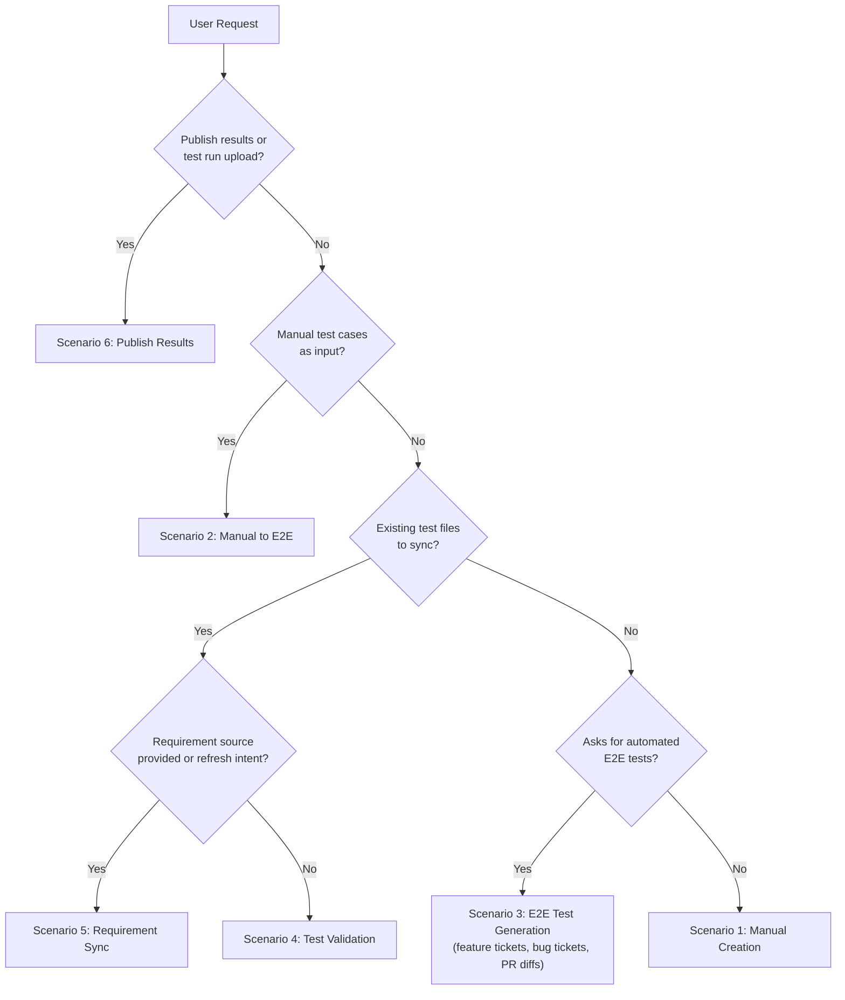
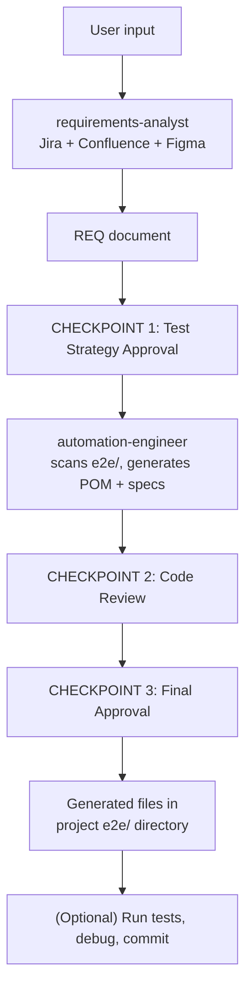
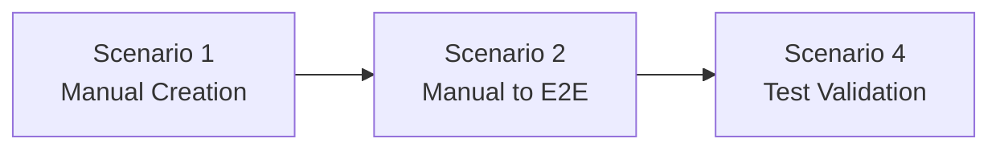
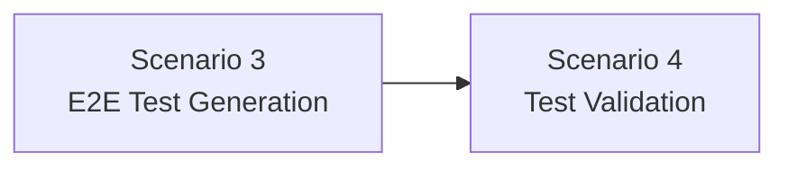
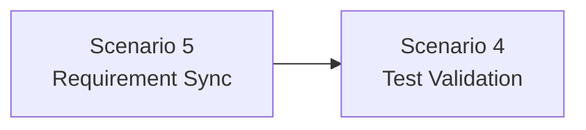

# SparQ Scenarios

## Scenario Overview

| # | Name | Trigger | Input | Output |
|---|------|---------|-------|--------|
| 1 | Manual Test Creation | `/sparq:generate-manual` | Jira ticket, Figma link, requirements text | Manual test cases (MD + XML), coverage matrix |
| 1+2 | Generate (Unified) | `/sparq:generate` | Jira ticket, Figma link, requirements text | Manual test cases (MD + XML) AND E2E specs, page objects, fixtures |
| 2 | Manual to E2E | `/sparq:manual-to-e2e` | Existing manual test cases (file or pasted) | E2E specs, page objects, step helpers |
| 3 | E2E Test Generation | `/sparq:generate-e2e` | Feature ticket, bug ticket, PR diff, Figma link, requirements text | E2E specs, page objects, fixtures (bug tickets produce inline regression tests with `REG-` IDs) |
| 4 | Test Validation | `/sparq:validate` | Path to existing test files | Validation report, auto-fixes |
| 5 | Requirement Sync | `/sparq:sync` | Test files + requirement source (or test files with registry history) | Diff report, updated tests, registry update |
| 6 | Publish Results | `/sparq:publish-results` | Playwright JSON or JUnit XML report | TMS test run with pass/fail results |

Default entry is `/sparq:start`, which routes through:
- `Generate` lane: manual-only, E2E-only, or unified generation
- `Maintain` lane: validate, sync, export

## Decision Tree

The orchestrator classifies every request using this logic:



**Classification signals:**

- **Scenario 6** -- `/sparq:publish-results` invocation, or mentions of "publish results", "test run", "upload results" with a report file path
- **Scenario 2** -- pasted test steps, file path to `.md`/`.xml` with test cases
- **Scenario 5** -- existing test files + requirement source + words like "refresh", "update", "sync", "requirements changed", or `/sparq:sync` invocation
- **Scenario 4** -- path to `e2e/` or `.spec.ts` files, words like "validate", "check", "stale" (no requirement source), or `/sparq:validate` invocation
- **Scenario 3** -- words like "automate", "e2e", "automated tests", "playwright"; also bug ticket IDs with "regression", "bug", "repro", "BUG-" prefix; also PR URLs, branch diffs
- **Scenario 1** -- Jira ticket ID, feature name, "test cases", "QA checklist"

### Test Categories

SparQ organizes test cases into five categories:

- **HP (Happy Path)** -- Core user workflows that must always work
- **VE (Validation & Error)** -- Input validation, error states, boundary conditions
- **SEC (Security)** -- Authentication, authorization, XSS, injection vectors
- **EC (Edge Case)** -- Unusual inputs, race conditions, extreme values
- **A11Y (Accessibility)** -- Screen reader, keyboard navigation, WCAG compliance

---

## Scenario 1: Manual Test Creation

**Skill:** `/sparq:generate-manual`

### Input Examples

```
/sparq:generate-manual EP-14
/sparq:generate-manual for the login feature
/sparq:generate-manual EP-14 https://www.figma.com/design/abc123
```

### Phase Walkthrough

**Phase 0 -- Classification**
Orchestrator reads input, loads config, classifies as Scenario 1, creates execution plan.

**Phase 0.5 -- Project Discovery**
Scans `e2e/` for existing infrastructure (page objects, components, steps, fixtures, naming conventions). Results cached in `sparq.config.json` under `e2e.detected`.

**Phase 1 -- Requirements Gathering**
If no requirements doc exists, dispatches requirements-analyst to query all enabled MCP sources in parallel, extract acceptance criteria, UI elements, and user journeys.

**Checkpoint 1: Plan Approval**
Shows: classified scenario, requirements summary, estimated test count by category (Happy Path, Validation, Security, Edge Cases, Accessibility), open questions. Blocks until approved.

**Phase 2 -- Test Case Generation**
Manual-test-writer generates test cases across all categories. Each includes ID, priority, preconditions, numbered steps with expected results, and requirement traceability.

**Checkpoint 2: Output Review**
User reviews test cases, coverage matrix, and gap analysis. Can request changes or approve.

**Checkpoint 3: Final Approval**
User confirms final test case set and coverage. Can request TMS export.

**Phase 3 -- Export (Optional)**
Offers to chain into `/sparq:export` for TMS import (TestRail, Qase, or local folder).

### Output Files

- `.sparq/requirements/REQ-{feature}.md` -- Structured requirements
- `.sparq/test-cases/TC-{feature}-manual.md` -- Markdown test cases
- `.sparq/test-cases/TC-{feature}-manual.xml` -- TestRail XML
- `.sparq/coverage/coverage-matrix.md` -- Requirement-to-test coverage
- `.sparq/plans/execution-plan.md` -- Execution tracking (temporary)

---

## Unified Generate (S1+S2)

**Skill:** `/sparq:generate`

Combines Scenario 1 (Manual Creation) and Scenario 2 (Manual to E2E) in a single streamlined flow. The S1-to-S2 transition is automatic — no chain-offer checkpoint between them.

### Input Examples

```
/sparq:generate EP-14
/sparq:generate for the login feature
/sparq:generate EP-14 https://www.figma.com/design/abc123
```

### Phase Walkthrough

**Phase 0 -- Classification**
Orchestrator classifies as S1 with autoChain to S2. Execution plan records `autoChain: true`.

**Phase 0.5 -- Project Discovery**
Full E2E infrastructure scan (same as Scenario 1).

**Phase 1 -- Requirements Gathering**
Same as Scenario 1 Phase 1.

**Checkpoint 1: Unified Plan Approval**
Shows: manual test plan (categories, counts) + E2E strategy (automatable vs manual-only split, infrastructure needs). Blocks until approved.

**Phase 2a -- Manual Test Generation**
Manual-test-writer generates test cases across all 5 categories. Same as Scenario 1 Phase 2.

**Checkpoint 2a: Manual Test Review**
User reviews manual test cases. Approved cases become input for E2E generation.

**Phase 2b -- E2E Code Generation**
Automation-engineer converts approved manual tests to E2E code (Playwright or Cypress per config). Existing infrastructure is reused, never duplicated.

**Checkpoint 2b: E2E Code Review**
Generated code presented for review. Manual-only tests (visual, cross-browser, subjective UX) are skipped with a note.

**Phase 3 -- Verify, Registry & Export**
Smoke verify (Playwright: `npx playwright test --list`; Cypress: `npx cypress verify` + `npx tsc --noEmit`), update coverage matrix and test registry, optionally export via `/sparq:export`.

### Output Files

- `.sparq/test-cases/TC-{feature}-manual.md` -- Markdown test cases
- `.sparq/test-cases/TC-{feature}-manual.xml` -- TestRail XML
- `e2e/pages/{Feature}Page.ts` -- Page Object Models (per `e2e.structure.pages`)
- `e2e/steps/{feature}Steps.ts` -- Reusable step helpers (per `e2e.structure.steps`)
- `e2e/fixtures/{feature}Fixture.ts` -- Test fixtures (per `e2e.structure.fixtures`)
- `e2e/specs/{feature}.spec.ts` -- E2E test specs (per `e2e.structure.specs`)
- `.sparq/coverage/coverage-matrix.md` -- Coverage tracking

---

## Scenario 2: Manual to E2E

**Skill:** `/sparq:manual-to-e2e`

### Input Examples

```
/sparq:manual-to-e2e .sparq/test-cases/TC-login-manual.md
/sparq:manual-to-e2e these test cases to automation
(paste test case steps directly in prompt)
```

### Phase Walkthrough

**Phase 0 -- Classification**
Detects manual test cases as input (file path or pasted content), classifies as Scenario 2.

**Phase 0.5 -- Project Discovery**
Scans `e2e/` to ensure generated code matches existing patterns and naming conventions.

**Phase 1 -- Parse and Enrich**
Parses test cases to extract IDs, titles, preconditions, steps, expected results. If Figma MCP is available, selectors are enriched from design component names. Automation-engineer scans `e2e/` for existing page objects, helpers, fixtures, auth patterns.

**Checkpoint 1: Clarify Ambiguities**
Questions about: test data requirements, authentication needs, ambiguous UI elements, steps needing API mocking. Blocks until answered.

**Phase 2 -- Code Generation**
Generates E2E code (Playwright or Cypress per config): page objects, spec files grouped by category, new helpers. Existing infrastructure is reused, never duplicated. Manual-test-writer may run a gap analysis for missing categories.

**Checkpoint 2: Output Review**
Generated code presented for review. Manual-only tests (visual, cross-browser, subjective UX) are skipped with a note.

**Checkpoint 3: Final Approval**
User approves final code. Files are written directly to the project `e2e/` directory.

**Phase 3 -- Verify (Optional)**
If Playwright CLI is available, offers to verify selectors in the live DOM.

### Output Files

- `e2e/pages/{Feature}Page.ts` -- Page Object Models (per `e2e.structure.pages`)
- `e2e/steps/{feature}Steps.ts` -- Reusable step helpers (per `e2e.structure.steps`)
- `e2e/specs/{feature}.spec.ts` -- E2E test specs (per `e2e.structure.specs`)

---

## Scenario 3: E2E Test Generation

**Skill:** `/sparq:generate-e2e`

### Input Examples

```
/sparq:generate-e2e EP-198 User Creation
/sparq:generate-e2e EP-14
/sparq:generate-e2e for the invoice management feature
```

### End-to-End Flow



### Strategy Checkpoint

Before generating code, the orchestrator presents:

- **Automatable tests** -- list suitable for E2E automation
- **Manual-only tests** -- requiring human judgment
- **Priority order** -- P1 critical paths first, then P2, P3
- **Dependencies** -- auth setup, test data, API mocks
- **Infrastructure** -- new page objects, fixtures, helpers required

### Output Files

- `.sparq/requirements/REQ-{feature}.md`
- `e2e/pages/{Feature}Page.ts` (per `e2e.structure.pages`)
- `e2e/steps/{feature}Steps.ts` (per `e2e.structure.steps`)
- `e2e/fixtures/{feature}Fixture.ts` (per `e2e.structure.fixtures`)
- `e2e/specs/{feature}.spec.ts` (per `e2e.structure.specs`)

---

## Scenario 4: Test Validation

**Skill:** `/sparq:validate`

Validates existing tests against the current UI and codebase to detect broken selectors, stale flows, and coverage gaps. For requirement-based sync, use `/sparq:sync` instead.

### Input Examples

```
/sparq:validate e2e/specs/auth/
/sparq:validate e2e/
/sparq:validate e2e/specs/login.spec.ts
```

### Phase Walkthrough

**Phase 0.5 -- Project Discovery**
Scans `e2e/` to ensure validation findings reference correct project patterns.

**Phase 1 -- Analysis**
Reads test files, extracts selectors, URLs, expected text, flow sequences, assertions. Fetches current state in parallel:

- **Codebase** -- grep for `data-testid`, route definitions, component files
- **Figma** -- current component names, layout, text content
- **Playwright CLI** — actual rendered DOM (if available)

**Phase 2 -- Comparison**

| Check | Finding Type |
|-------|-------------|
| `data-testid` removed/renamed | Broken selector |
| Route no longer exists | Stale flow |
| Button text changed in Figma | UI text mismatch |
| New acceptance criteria without tests | Coverage gap |
| Tests using deprecated helpers | Deprecated pattern |
| Tests for removed features | Dead test |

### Finding Severities

- **Critical** -- test will fail at runtime (e.g., `data-testid="login-btn"` not in codebase)
- **Warning** -- test may be unreliable (e.g., button text changed)
- **Info** -- improvement opportunity (e.g., new requirement has no coverage)

### Fix Workflow

After presenting findings, the user chooses:

- **`apply all`** -- auto-fix all Critical and Warning findings
- **`review`** -- step through findings one-by-one
- **`report only`** -- save report, make no changes

For approved fixes, automation-engineer updates selectors, expected text, and removes dead tests. Re-validation confirms all Critical issues resolved.

### Output Files

- `.sparq/validation/validation-report.md`

---

## Scenario 5: Requirement Sync

**Skill:** `/sparq:sync`

Syncs existing tests with updated requirements by diffing current requirements against test coverage. After requirement sync, consider running `/sparq:validate` for technical freshness checks.

### Input Examples

```
/sparq:sync EP-14 e2e/specs/auth/login.spec.ts    # ticket + file
/sparq:sync e2e/specs/user-creation.spec.ts        # file only (auto-detect source)
/sparq:sync EP-14                                   # ticket only (find linked tests)
/sparq:sync e2e/specs/auth/                         # directory
```

### Phase Walkthrough

**Phase 0 -- Classification**
Orchestrator detects existing test files combined with a requirement source and refresh intent. Classifies as Scenario 5 (test refresh).

**Phase 1 -- Dual Gathering** (parallel)
Two tasks run simultaneously:
- **Task A (test-validator):** Reads test registry (`.sparq/tracking/test-registry.json`), parses existing test files, extracts TC IDs, builds traceability map `{TC-ID → [REQ-IDs]}`, catalogs assertions and structure.
- **Task B (requirements-analyst):** Fetches CURRENT requirements from Jira/Confluence/Figma. If previous requirements exist, copies them to `.sparq/refresh/REQ-{feature}-previous.md` before overwriting.

**Phase 1.5 -- Diff Analysis**
Orchestrator compares current requirements against test coverage using content hashing and registry data. Classifies each requirement as NEW / CHANGED / REMOVED / UNCHANGED. For CHANGED items, assesses severity (High = logic change, Medium = criteria added/removed, Low = text-only). Generates diff report at `.sparq/refresh/REFRESH-{feature}-diff.md`.

**Checkpoint 1: Diff Approval**
Shows: counts by category, each item with detail and recommended action, affected test files and TC IDs. If all hashes match, reports "Tests are up to date" and stops. Blocks until user approves which changes to apply.

**Phase 2 -- Update Generation**
Based on approved diff, delegates to automation-engineer (E2E specs) or manual-test-writer (manual tests):
- **NEW** → generate new test blocks, continue TC ID sequence from highest existing
- **CHANGED-HIGH** → suggest rewrite with before/after comparison, mark `// [REFRESH] REVIEW`
- **CHANGED-MEDIUM** → update assertions/steps inline, mark `// [REFRESH] UPDATED`
- **CHANGED-LOW** → add comment `// [REFRESH] NOTE`
- **REMOVED** → mark `// [REFRESH] DEPRECATED` (never auto-delete)

**Checkpoint 2: Output Review**
Presents proposed changes with before/after for each modified file. Blocks until approved.

**Phase 3 -- Apply and Verify**
Applies approved changes, runs smoke verification per framework, updates coverage matrix and test registry with new `lastRefreshedAt`, `requirementsHash`, and any new `testIds`.

**Optional Chain → Test Validation**
Offers to run `/sparq:validate` for technical freshness check (selectors, flows) on the updated test files.

### Output Files

- `.sparq/refresh/REFRESH-{feature}-diff.md` -- Diff analysis report
- `.sparq/refresh/REFRESH-{feature}-updates.md` -- Proposed changes with before/after
- `.sparq/refresh/REQ-{feature}-previous.md` -- Previous requirements snapshot
- Updated test files in project `e2e/` directory (direct-write)
- `.sparq/coverage/coverage-matrix.md` -- Updated coverage matrix
- `.sparq/tracking/test-registry.json` -- Updated registry entries

---

## Scenario 6: Publish Results

**Skill:** `/sparq:publish-results`

Reads Playwright JSON or JUnit XML test output from a CI run, maps test titles to TC IDs, creates a test run in the configured TMS, and posts pass/fail/skip per matched test case.

### Input Examples

```
/sparq:publish-results
/sparq:publish-results playwright-report/results.json
/sparq:publish-results test-results/junit.xml
```

### Phase Walkthrough

**Step 1 -- Resolve TMS Provider**
Reads `outputs.tms.provider` from `sparq.config.json`. If missing, asks which TMS to publish to (testrail / qase / zephyr).

**Step 2 -- Locate and Parse Output**
Checks standard output paths in order: `playwright-report/results.json`, `test-results/*.json`, `test-results/**/*.xml`, `cypress/results/**/*.xml`. Detects format (Playwright JSON vs JUnit XML) and parses all test results: title, status, duration, error message.

**Step 3 -- Map TC IDs**
Applies regex `TC-[A-Z0-9]+-[A-Z0-9]+-\d+` to each test title. Matched results are associated with their TC ID; unmatched results are grouped as "Untracked Tests".

**Step 4 -- Create Run and Post Results**
Creates a test run named `SparQ Results — {date} {branch}` in the TMS. Posts pass/fail/skip per matched test case using the appropriate MCP tool. Falls back to a local CSV at `.sparq/results/{date}-results.csv` if MCP is unavailable.

**Step 5 -- Report**
Emits summary: provider, run URL (or CSV path), posted counts (passed/failed/skipped), and count of untracked tests.

### Output Files

- TMS test run with results (via MCP) — or `.sparq/results/{date}-results.csv` (fallback)

---

## Composability

Scenarios chain for end-to-end workflows. The orchestrator offers chaining automatically when a scenario completes.

### Common Chains



```mermaid
flowchart LR
  A[/sparq:analyze] --> Gen[Scenario 1 or 3<br/>Test Generation] --> E[/sparq:export]
```





### Chaining Rules

- Chained scenarios reuse the requirements document (no re-gathering)
- Each chained scenario gets its own Phase 2 checkpoint
- `execution-plan.md` tracks the full chain as a single execution
- After Scenario 1: orchestrator offers Scenario 2
- After Scenario 3: orchestrator offers Scenario 4 (Test Validation)
- `/sparq:generate` runs S1 -> S2 automatically (no chain-offer prompt)
- After Scenario 5: orchestrator offers Scenario 4 (Test Validation)

### Composability Matrix

| From → To | S1 | S2 | S3 | S4 | S5 |
|-----------|----|----|----|----|-----|
| **S1** | — | Offered | — | — | — |
| **S2** | — | — | — | Offered | — |
| **S3** | — | — | — | Offered | — |
| **S4** | — | — | — | — | — |
| **S5** | — | — | — | Offered | — |

**Rules**: S1→S2 is auto-chained in `/sparq:generate`. All other chains are offered (user can accept or decline). S4 is terminal (no further chain). Chained scenarios reuse requirements (no re-gathering). Each chain gets its own Phase 2 checkpoint.

### Example: Full Pipeline

```
User: /sparq:generate-manual EP-14

  Phase 0.5: project discovery (e2e/ scan)
  Phase 1: requirements-analyst gathers from Jira + Figma
  Checkpoint 1: Plan approved
  Phase 2: manual-test-writer generates 26 test cases
  Checkpoint 2: Output approved
  Checkpoint 3: Final approved

  "Would you like to convert these to automated tests?"
  User: yes

  Phase 2 (chained): automation-engineer converts to E2E code
  Checkpoint 2: Code approved
  Checkpoint 3: Final approved

  "Would you like to export to a TMS (TestRail, Qase, or local folder)?"
  User: yes

  Phase 3: orchestrator exports via TMS MCP
  Done.
```

---

## Supporting Skills

### `/sparq:analyze` (Pre-Phase)

Gather and review requirements independently before running any test generation scenario. Output consumed by Scenarios 1 and 3 automatically.

```
/sparq:analyze EP-14
/sparq:analyze https://www.figma.com/design/abc123
/sparq:analyze EP-14 https://team.atlassian.net/wiki/spaces/PROJ/pages/123
```

Accepts multiple inputs in a single call. Writes to `.sparq/requirements/REQ-{feature}.md`.

### `/sparq:export` (Post-Phase)

Export test cases to TestRail, Qase, local folder, Jira, and/or Confluence. Offered automatically after Scenario 1.

```
/sparq:export login                    # export to all enabled targets
/sparq:export testrail login           # TestRail only
/sparq:export qase login              # Qase only
/sparq:export local login             # local folder only
/sparq:export jira EP-14               # link coverage to Jira ticket
/sparq:export confluence login         # publish test plan to Confluence
```

Without a target, exports to all enabled targets in `sparq.config.json`. If an MCP connection is unavailable, generates importable files with manual instructions.

### `/sparq:refactor` (Maintenance)

Bulk rename selectors, imports, class names, and references across test files after codebase refactoring. Routes through test-validator in refactor mode.

```
/sparq:refactor --from "LoginForm" --to "AuthenticationForm" e2e/
/sparq:refactor --from "data-testid='submit-btn'" --to "data-testid='form-submit'" e2e/specs/auth/
```

Greps all test files in scope, shows occurrences with context, applies replacements after approval, runs smoke verification.

### `sparq lint` (Post-Generation Quality Check)

Runs deterministic rubrics on generated E2E test files — no AI inference, instant, CI-compatible. Offered automatically after code-generating scenarios (S2, S3, S1+S2).

```bash
npx sparq-assistant lint e2e/                       # full E2E directory
npx sparq-assistant lint e2e/specs/auth/            # specific subdirectory
npx sparq-assistant lint e2e/ --strict              # non-zero exit on critical findings
```

Rubrics: flaky pattern detection, locator quality, Playwright/Cypress syntax, assertion coverage, naming conventions, error handling, format compliance.

**Complementary to `/sparq:validate`**: lint checks code patterns; `/sparq:validate` checks UI/selector drift against live codebase and Figma.

---

**See also**: [LIMITATIONS.md](LIMITATIONS.md) for known constraints and workarounds.
